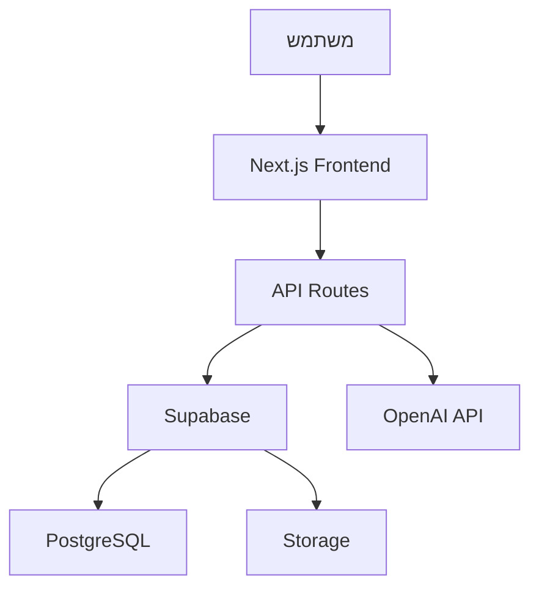

# ארכיטקטורת המערכת 🏗️

## סקירה כללית 📝

הדרך היא פלטפורמת למידה מקוונת המבוססת על Next.js 14 ומשתמשת בארכיטקטורת App Router החדשה.

## שכבות המערכת 🔄

### 1. שכבת הממשק (Frontend)

- **Next.js App Router** - ניתוב ותצוגה
- **React** - ניהול ממשק המשתמש
- **Tailwind CSS** - עיצוב ועיצוב רספונסיבי
- **shadcn/ui** - ספריית UI קומפוננטות
- **Redux Toolkit** - ניהול מצב גלובלי
- **React Query** - ניהול מצב שרת וקאש

### 2. שכבת השרת (Backend)

- **Next.js API Routes** - נקודות קצה של השרת
- **Supabase** - בסיס נתונים ואימות
- **OpenAI API** - שירותי AI וצ'אטבוט

### 3. שכבת הנתונים (Data)

- **PostgreSQL** (via Supabase) - בסיס נתונים ראשי
- **Redis** - קאש וניהול סשנים
- **Supabase Storage** - אחסון קבצים

## קומפוננטות ראשיות 🧩

### דשבורד

- **LatestForumPosts** - הצגת פוסטים אחרונים
- **RecommendedCoursesPreview** - קורסים מומלצים
- **ReferralManagement** - ניהול הפניות
- **SocialRecommendations** - המלצות חברתיות

### קורסים

- **CourseContent** - תצוגת תוכן הקורס
- **CourseComments** - מערכת תגובות
- **CourseRatings** - מערכת דירוגים

### אימות והרשאות

- **AuthProvider** - ניהול אימות משתמשים
- **PermissionsProvider** - ניהול הרשאות

## תזרים נתונים 🔄

## אבטחה 🔒

1. **אימות משתמשים**

   - Supabase Auth
   - JWT tokens
   - OAuth providers

2. **הרשאות**

   - RBAC (Role Based Access Control)
   - Row Level Security בבסיס הנתונים

3. **אבטחת מידע**
   - HTTPS
   - CORS
   - Rate Limiting

## ביצועים ⚡

1. **אופטימיזציה**

   - Server Components
   - Image Optimization
   - Code Splitting

2. **קאש**
   - React Query
   - Redis
   - Static Generation

## סביבות 🌍

1. **פיתוח**

   - Local Development
   - Staging
   - Production

2. **כלי פיתוח**
   - TypeScript
   - ESLint
   - Prettier
   - Jest
   - Playwright
