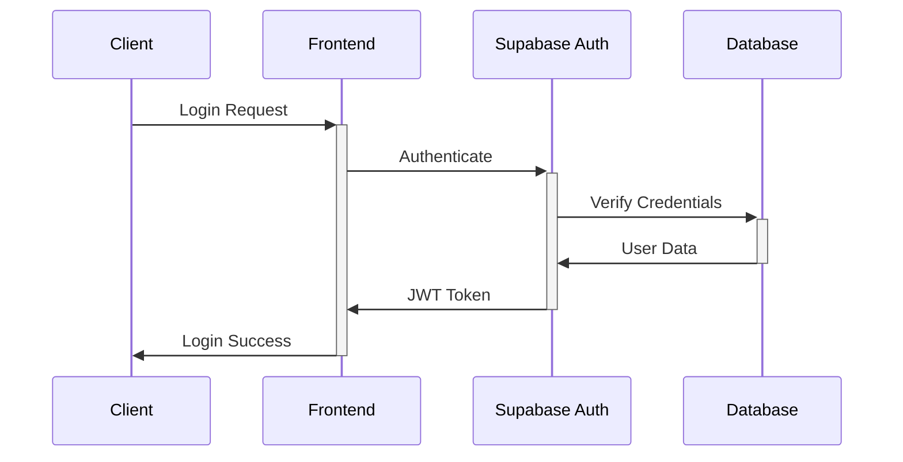
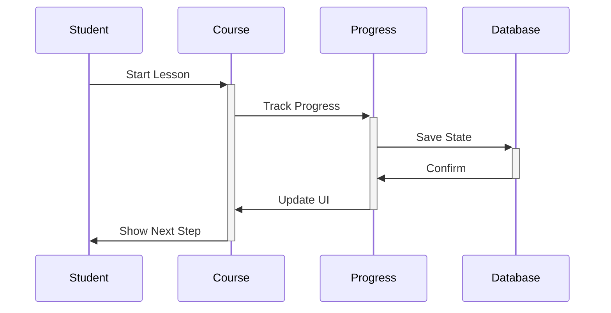

# ארכיטקטורת המערכת - פרויקט "הדרך" 🏗️

## 📋 סקירה כללית
"הדרך" היא פלטפורמת למידה מודרנית המבוססת על ארכיטקטורת מיקרו-פרונטנד עם Next.js 14 ו-Supabase. המערכת מתוכננת לתמוך בעשרות אלפי משתמשים במקביל, עם דגש על ביצועים, אבטחה, ונוחות שימוש.

## 🎯 עקרונות ארכיטקטוניים
1. **Micro-Frontend Architecture**
   - חלוקה לקומפוננטות עצמאיות
   - ניהול מצב מבוזר
   - בידוד לוגי של פיצ'רים

2. **Server-First Approach**
   - שימוש ב-Server Components
   - Static Site Generation (SSG)
   - Incremental Static Regeneration (ISR)
   - Edge Runtime לביצועים מהירים

3. **Type Safety**
   - TypeScript בכל שכבות האפליקציה
   - Zod לוולידציה של סכמות
   - End-to-end type safety

4. **Security by Design**
   - Row Level Security (RLS)
   - JWT Authentication
   - HTTPS Everywhere
   - Content Security Policy (CSP)

## 🏭 שכבות המערכת

### 1️⃣ Frontend Layer
```typescript
// שכבת הממשק המשתמש
interface FrontendLayer {
  presentation: {
    pages: 'Next.js App Router Pages',
    components: 'React Components',
    layouts: 'Responsive Layouts'
  },
  state: {
    server: 'React Query',
    client: 'Redux Toolkit',
    global: 'Context API'
  },
  styling: {
    framework: 'Tailwind CSS',
    components: 'shadcn/ui',
    animations: 'Framer Motion'
  }
}
```

### 2️⃣ Backend Layer
```typescript
// שכבת השרת
interface BackendLayer {
  api: {
    routes: 'Next.js API Routes',
    middleware: 'Edge Runtime',
    validation: 'Zod'
  },
  auth: {
    provider: 'Supabase Auth',
    strategy: 'JWT',
    mfa: 'Two Factor Auth'
  },
  storage: {
    files: 'Supabase Storage',
    cache: 'Redis',
    cdn: 'Vercel Edge Network'
  }
}
```

### 3️⃣ Database Layer
```typescript
// שכבת מסד הנתונים
interface DatabaseLayer {
  engine: 'PostgreSQL',
  provider: 'Supabase',
  features: {
    rls: 'Row Level Security',
    realtime: 'Supabase Realtime',
    functions: 'PostgreSQL Functions',
    triggers: 'Database Triggers'
  }
}
```

## 🔄 תהליכי ליבה

### 1. תהליך אימות


### 2. תהליך למידה


## 🔌 אינטגרציות חיצוניות

### 1. שירותי ענן
- **Vercel**: Hosting & Deployment
- **Supabase**: Database & Auth
- **OpenAI**: AI Features
- **Cloudinary**: Media Storage

### 2. שירותי ניטור
- **Sentry**: Error Tracking
- **Vercel Analytics**: Performance
- **LogRocket**: User Sessions
- **Uptime Robot**: Availability

## 📈 סקלביליות

### 1. אסטרטגיות Scaling
- **Horizontal Scaling**: Vercel Edge Network
- **Database Scaling**: Supabase Auto-scaling
- **Cache Optimization**: Redis & CDN
- **Load Balancing**: Automatic

### 2. מגבלות וספים
- **Rate Limiting**: 100 requests/minute
- **File Upload**: 10MB max
- **API Timeout**: 10 seconds
- **Concurrent Users**: 10,000+

## 🔒 אבטחה

### 1. שכבות הגנה
- **Network**: HTTPS, CORS, CSP
- **Application**: Input Validation, XSS Protection
- **Database**: RLS, Query Sanitization
- **Authentication**: JWT, MFA

### 2. מדיניות גיבוי
- **Database**: Daily Backups
- **Files**: Redundant Storage
- **Configuration**: Version Control
- **Disaster Recovery**: Multi-region

## 📱 תמיכה במובייל

### 1. Progressive Web App
- **Service Workers**: Offline Support
- **Push Notifications**: Real-time Updates
- **App Shell**: Fast Loading
- **Responsive Design**: Mobile First

### 2. Native Features
- **Camera Access**: Profile Pictures
- **Geolocation**: Local Content
- **File System**: Offline Storage
- **Share API**: Social Integration

## 📝 הערות
- הארכיטקטורה מתוכננת לגמישות ולהרחבה עתידית
- כל שינוי ארכיטקטוני דורש עדכון של המסמך
- יש לשמור על עקביות בין המימוש לתיעוד
- מומלץ לבצע סקירות ארכיטקטורה תקופתיות 