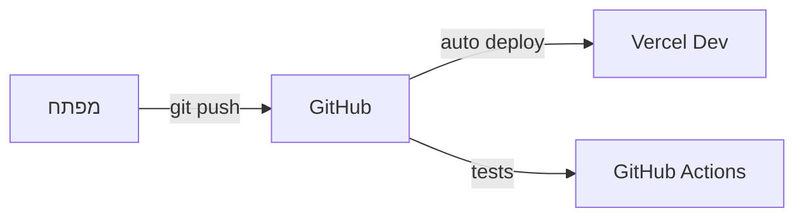
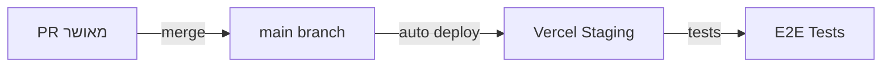
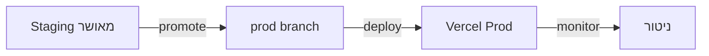

# תהליך הפצה - פרויקט "הדרך" 🚀

## 📋 סקירה כללית
מסמך זה מפרט את תהליך ההפצה המלא של הפרויקט, כולל סביבות, תהליכי CI/CD, ניטור ותחזוקה.

## 🌐 סביבות

### פיתוח (Development)


- **URL**: dev.haderech.com
- **מטרה**: פיתוח ובדיקות מקומיות
- **מאפיינים**:
  - Hot Reload
  - דאטה מדומה
  - כלי פיתוח
  - לוגים מפורטים

### בדיקות (Staging)


- **URL**: staging.haderech.com
- **מטרה**: בדיקות QA ואינטגרציה
- **מאפיינים**:
  - זהה לייצור
  - דאטה אנונימית
  - ניטור מלא
  - בדיקות אוטומטיות

### ייצור (Production)


- **URL**: haderech.com
- **מטרה**: סביבת משתמשי קצה
- **מאפיינים**:
  - ביצועים מקסימליים
  - אבטחה מלאה
  - גיבוי אוטומטי
  - ניטור 24/7

## 🔄 תהליך CI/CD

### אינטגרציה רציפה (CI)
```yaml
# .github/workflows/ci.yml
name: CI Pipeline
on:
  push:
    branches: [ main, dev ]
  pull_request:
    branches: [ main ]

jobs:
  test:
    runs-on: ubuntu-latest
    steps:
      - uses: actions/checkout@v2
      - name: Install Dependencies
        run: npm install
      - name: Run Tests
        run: npm test
      - name: Run Linting
        run: npm run lint
      - name: Build
        run: npm run build
```

### הפצה רציפה (CD)
```yaml
# vercel.json
{
  "version": 2,
  "builds": [
    {
      "src": "package.json",
      "use": "@vercel/next"
    }
  ],
  "routes": [
    {
      "src": "/(.*)",
      "dest": "/$1"
    }
  ],
  "env": {
    "NEXT_PUBLIC_SUPABASE_URL": "@supabase_url",
    "NEXT_PUBLIC_SUPABASE_ANON_KEY": "@supabase_key"
  }
}
```

## 🔒 אבטחה

### SSL/TLS
- Let's Encrypt אוטומטי
- חידוש אוטומטי
- דירוג A+ ב-SSL Labs

### הגנת תשתית
- WAF (Cloudflare)
- DDoS Protection
- Rate Limiting
- IP Filtering

### אבטחת מידע
- הצפנת נתונים
- גיבוי אוטומטי
- ניטור אבטחה
- GDPR Compliance

## 📊 ניטור וביצועים

### ניטור אפליקציה
```javascript
// monitoring.ts
import * as Sentry from '@sentry/nextjs';

Sentry.init({
  dsn: process.env.SENTRY_DSN,
  tracesSampleRate: 1.0,
  environment: process.env.VERCEL_ENV
});
```

### מדדי ביצועים
- Core Web Vitals
- זמני תגובה
- שימוש במשאבים
- זמינות מערכת

### התראות
- Slack
- Email
- SMS (קריטי)
- PagerDuty

## 🔄 גיבוי ושחזור

### גיבוי אוטומטי
```sql
-- supabase backup policy
CREATE POLICY "backup_daily" ON storage.objects
  FOR ALL USING (
    scheduled_backup() = true
  );
```

### תדירות
- יומי: גיבוי מלא
- שעתי: גיבוי תוספתי
- מיידי: לפני שינויים קריטיים

### שחזור
- נקודות שחזור
- שחזור סלקטיבי
- בדיקות שחזור תקופתיות

## 🚀 תהליך שחרור

### לפני השחרור
1. בדיקות רגרסיה
2. אישור QA
3. בדיקת ביצועים
4. סקירת אבטחה

### במהלך השחרור
1. גיבוי מלא
2. הפצה הדרגתית
3. ניטור מוגבר
4. צוות כוננות

### אחרי השחרור
1. אימות תקינות
2. בדיקות קצה
3. ניטור משתמשים
4. איסוף משוב

## 🛠️ כלים ושירותים

### תשתית
- Vercel: הפצה ואירוח
- Supabase: בסיס נתונים
- Cloudflare: CDN ואבטחה
- GitHub: קוד ו-CI/CD

### ניטור
- Sentry: ניטור שגיאות
- LogRocket: ניטור משתמשים
- Google Analytics: אנליטיקס
- Uptime Robot: זמינות

### תקשורת
- Slack: תקשורת צוות
- Email: התראות
- Status Page: סטטוס מערכת

## 📝 הערות
- יש לעדכן את תהליך ההפצה בהתאם לשינויים בארכיטקטורה
- חשוב לשמור על תיעוד מעודכן של כל שינוי בתצורה
- נדרש לבצע תרגולי שחזור תקופתיים
- יש לשמור על מדיניות גרסאות ברורה
