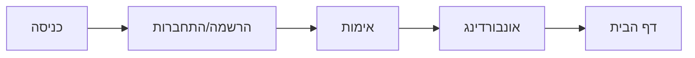

# מפרט משתמש - פרויקט "הדרך" 👥

## 📋 סקירה כללית

"הדרך" היא פלטפורמת למידה המיועדת לסייע לאנשים לשפר את מערכות היחסים שלהם באמצעות למידה, תרגול ותמיכה קהילתית.

## 👤 פרופילי משתמשים

### משתמש רגיל

**תיאור**: משתמש המחפש לשפר את מערכות היחסים שלו
**מאפיינים**:

- גיל: 25-45
- רמת מחשב: בסיסית עד בינונית
- זמן פנוי: מוגבל
- מוטיבציה: גבוהה לשיפור עצמי

**צרכים**:

1. גישה קלה ונוחה לתכנים
2. מעקב אחר התקדמות
3. תמיכה וייעוץ
4. גמישות בלמידה

### מנחה מקצועי

**תיאור**: מטפל או יועץ זוגי המשתמש במערכת ככלי עזר
**מאפיינים**:

- ניסיון מקצועי
- הבנה מעמיקה בתחום
- צורך בכלים מתקדמים
- עבודה עם מטופלים

**צרכים**:

1. גישה לחומרים מקצועיים
2. יכולת התאמה אישית
3. כלי מעקב והערכה
4. שיתוף תכנים

### מנהל מערכת

**תיאור**: אחראי על ניהול ותחזוקת המערכת
**מאפיינים**:

- ידע טכני מתקדם
- הרשאות מיוחדות
- אחריות על תוכן
- ניהול משתמשים

**צרכים**:

1. כלי ניהול מתקדמים
2. דוחות וסטטיסטיקות
3. ניהול הרשאות
4. ניטור מערכת

## 🛣️ מסע המשתמש

### 1. הרשמה והתחברות



### 2. אונבורדינג

- מצגת הדרכה למשתמשים חדשים
- הגדרת פרופיל ראשוני
- בחירת תחומי עניין
- סקירת פיצ'רים עיקריים

### 3. דף הבית

- סקירת התקדמות אישית
- גישה מהירה לפיצ'רים מרכזיים
- המלצות מותאמות אישית
- עדכונים מהקהילה

### 4. למידה

- צפייה בקורסים
- ביצוע תרגילים
- מעקב התקדמות
- קבלת משוב

### 5. קהילה

- השתתפות בדיונים
- שיתוף חוויות
- קבלת תמיכה
- יצירת קשרים

## 🎨 עיצוב ו-UX

### צבעים

```css
:root {
  --primary: #4a90e2; /* כחול */
  --secondary: #7ed321; /* ירוק */
  --background: #ffffff; /* לבן */
  --text: #333333; /* אפור כהה */
  --error: #ff4d4d; /* אדום */
  --success: #34c759; /* ירוק */
}
```

### טיפוגרפיה

- **כותרות**: Rubik Bold
  - ראשית: 24px
  - משנית: 20px
  - תת-כותרת: 18px
- **טקסט**: Rubik Regular
  - רגיל: 16px
  - קטן: 14px
  - הערות: 12px

### אייקונים ואלמנטים

- ספריית Feather Icons
- גודל סטנדרטי: 24x24px
- עיגול פינות: 4px
- מרווחים: 8px/16px/24px
- צללים: 0 2px 4px rgba(0,0,0,0.1)

### Responsive Design

```css
/* נקודות שבירה */
@media (max-width: 767px) {
  /* נייד */
}
@media (min-width: 768px) and (max-width: 1023px) {
  /* טאבלט */
}
@media (min-width: 1024px) {
  /* דסקטופ */
}
```

## 🎯 דרישות פונקציונליות

### 1. ניהול משתמשים

- [x] הרשמה והתחברות
- [x] ניהול פרופיל
- [x] הרשאות ותפקידים
- [ ] אימות דו-שלבי

### 2. מערכת למידה

- [x] צפייה בקורסים
- [x] מעקב התקדמות
- [ ] בחנים ותרגילים
- [ ] תעודות השלמה

### 3. קהילה ותקשורת

- [x] פורום דיונים
- [ ] הודעות פרטיות
- [ ] קבוצות למידה
- [ ] שיתוף תוכן

### 4. תכונות מתקדמות

- [ ] AI לייעוץ אישי
- [ ] סימולטור תרחישים
- [ ] ניתוח התקדמות
- [ ] המלצות מותאמות אישית

## 📱 תמיכה במכשירים

### נייד

- תצוגה מותאמת
- ניווט פשוט
- טעינה מהירה
- חסכון בנתונים

### טאבלט

- תצוגה היברידית
- מולטי-טאסקינג
- תמיכה בעט
- תצוגת ספר

### דסקטופ

- תצוגה מלאה
- קיצורי מקלדת
- חלונות מרובים
- כלים מתקדמים

## 🔒 פרטיות ואבטחה

### הגנת מידע

- הצפנת נתונים
- אימות מאובטח
- הגנה מפני התקפות
- גיבוי מידע

### פרטיות

- שליטה בנראות
- הגדרות פרטיות
- מחיקת חשבון
- ייצוא נתונים

## 📝 הערות

- המפרט מתעדכן באופן שוטף
- יש להתחשב במשוב משתמשים
- נדרשת גמישות בהתאמות
- חשוב לשמור על פשטות
