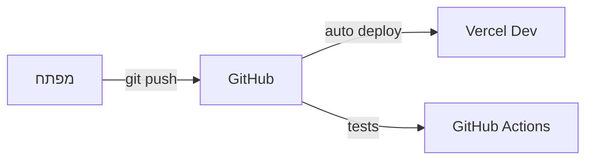
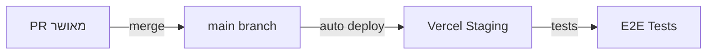
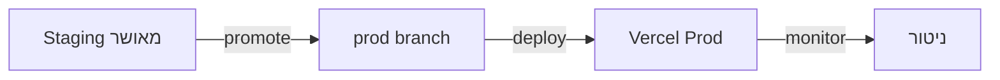

# תהליך הפצה - פרויקט "הדרך" 🚀

## 📋 סקירה כללית

מסמך זה מפרט את תהליך ההפצה המלא של הפרויקט, כולל סביבות, תהליכי CI/CD, ניטור ותחזוקה.

## 🌐 סביבות

### פיתוח (Development)



- **URL**: dev.haderech.com
- **מטרה**: פיתוח ובדיקות מקומיות
- **מאפיינים**:
  - Hot Reload
  - דאטה מדומה
  - כלי פיתוח
  - לוגים מפורטים

### בדיקות (Staging)



- **URL**: staging.haderech.com
- **מטרה**: בדיקות QA ואינטגרציה
- **מאפיינים**:
  - זהה לייצור
  - דאטה אנונימית
  - ניטור מלא
  - בדיקות אוטומטיות

### ייצור (Production)



- **URL**: haderech.com
- **מטרה**: סביבת משתמשי קצה
- **מאפיינים**:
  - ביצועים מקסימליים
  - אבטחה מלאה
  - גיבוי אוטומטי
  - ניטור 24/7

## 🔄 תהליך CI/CD

### אינטגרציה רציפה (CI)

```yaml
# .github/workflows/ci.yml
name: CI Pipeline
on:
  push:
    branches: [main, dev]
  pull_request:
    branches: [main]

jobs:
  test:
    runs-on: ubuntu-latest
    steps:
      - uses: actions/checkout@v2
      - name: Setup Node.js
        uses: actions/setup-node@v3
        with:
          node-version: "18"
      - name: Install pnpm
        uses: pnpm/action-setup@v2
        with:
          version: 8
      - name: Install Dependencies
        run: pnpm install
      - name: Type Check
        run: pnpm run type-check
      - name: Run Tests
        run: pnpm run test
      - name: Run Linting
        run: pnpm run lint:strict
      - name: Build
        run: pnpm run build
```

### הפצה רציפה (CD)

```yaml
# vercel.json
{
  "version": 2,
  "buildCommand": "pnpm run build",
  "devCommand": "pnpm run dev",
  "installCommand": "pnpm install",
  "framework": "nextjs",
  "regions": ["fra1"],
  "env":
    {
      "NEXT_PUBLIC_APP_URL": "@next_public_app_url",
      "NEXT_PUBLIC_SUPABASE_URL": "@next_public_supabase_url",
      "NEXT_PUBLIC_SUPABASE_ANON_KEY": "@next_public_supabase_anon_key",
      "SUPABASE_SERVICE_ROLE_KEY": "@supabase_service_role_key",
      "OPENAI_API_KEY": "@openai_api_key",
      "NEXTAUTH_URL": "@nextauth_url",
      "NEXTAUTH_SECRET": "@nextauth_secret",
    },
  "headers":
    [
      {
        "source": "/(.*)",
        "headers":
          [
            { "key": "X-Content-Type-Options", "value": "nosniff" },
            { "key": "X-Frame-Options", "value": "DENY" },
            { "key": "X-XSS-Protection", "value": "1; mode=block" },
            {
              "key": "Referrer-Policy",
              "value": "strict-origin-when-cross-origin",
            },
          ],
      },
    ],
}
```

## ✅ רשימת תיוג לפני הפצה

### 1. הכנת קוד

- [ ] כל הבדיקות עוברות (`pnpm run test`)
- [ ] אין שגיאות לינטינג (`pnpm run lint:strict`)
- [ ] אין שגיאות טיפוסים (`pnpm run type-check`)
- [ ] הבנייה מצליחה (`pnpm run build`)
- [ ] כל הקבצים נשמרו ונדחפו ל-Git

### 2. הגדרת Vercel

- [ ] פרויקט חדש נוצר ב-Vercel
- [ ] הגדרת משתני סביבה:
  - [ ] `NEXT_PUBLIC_APP_URL`
  - [ ] `NEXT_PUBLIC_SUPABASE_URL`
  - [ ] `NEXT_PUBLIC_SUPABASE_ANON_KEY`
  - [ ] `SUPABASE_SERVICE_ROLE_KEY`
  - [ ] `OPENAI_API_KEY`
  - [ ] `NEXTAUTH_URL`
  - [ ] `NEXTAUTH_SECRET`
- [ ] הגדרת דומיין מותאם אישית
- [ ] הגדרת SSL/TLS
- [ ] הגדרת אזור הפצה (Region)

### 3. בדיקות אבטחה

- [ ] סריקת חולשות אבטחה
- [ ] בדיקת הרשאות API
- [ ] וידוא CORS תקין
- [ ] בדיקת תוקף SSL
- [ ] בדיקת Headers אבטחה

### 4. בדיקות ביצועים

- [ ] ציון Lighthouse מעל 90
- [ ] זמני טעינה תקינים
- [ ] אופטימיזציה לתמונות
- [ ] מטמון תקין
- [ ] בדיקת Core Web Vitals

### 5. בדיקות תוכן

- [ ] תרגומים מלאים
- [ ] תקינות קישורים
- [ ] תקינות תמונות
- [ ] בדיקת נגישות
- [ ] תקינות טפסים

### 6. ניטור והתראות

- [ ] הגדרת Sentry
- [ ] הגדרת Google Analytics
- [ ] הגדרת התראות Slack
- [ ] הגדרת Status Page
- [ ] בדיקת לוגים

## 🔒 אבטחה

### SSL/TLS

- Let's Encrypt אוטומטי
- חידוש אוטומטי
- דירוג A+ ב-SSL Labs

### הגנת תשתית

- WAF (Cloudflare)
- DDoS Protection
- Rate Limiting
- IP Filtering

### אבטחת מידע

- הצפנת נתונים
- גיבוי אוטומטי
- ניטור אבטחה
- GDPR Compliance

## 📊 ניטור וביצועים

### ניטור אפליקציה

```typescript
// monitoring.ts
import * as Sentry from "@sentry/nextjs";

Sentry.init({
  dsn: process.env.SENTRY_DSN,
  tracesSampleRate: 1.0,
  environment: process.env.VERCEL_ENV,
});
```

### מדדי ביצועים

- Core Web Vitals
- זמני תגובה
- שימוש במשאבים
- זמינות מערכת

### התראות

- Slack
- Email
- SMS (קריטי)
- PagerDuty

## 🔄 גיבוי ושחזור

### גיבוי אוטומטי

```sql
-- supabase backup policy
CREATE POLICY "backup_daily" ON storage.objects
  FOR ALL USING (
    scheduled_backup() = true
  );
```

### תדירות

- יומי: גיבוי מלא
- שעתי: גיבוי תוספתי
- מיידי: לפני שינויים קריטיים

### שחזור

- נקודות שחזור
- שחזור סלקטיבי
- בדיקות שחזור תקופתיות

## 🚀 תהליך שחרור

### לפני השחרור

1. בדיקות רגרסיה
2. אישור QA
3. בדיקת ביצועים
4. סקירת אבטחה

### במהלך השחרור

1. גיבוי מלא
2. הפצה הדרגתית
3. ניטור מוגבר
4. צוות כוננות

### אחרי השחרור

1. אימות תקינות
2. בדיקות קצה
3. ניטור משתמשים
4. איסוף משוב

## 🛠️ כלים ושירותים

### תשתית

- Vercel: הפצה ואירוח
- Supabase: בסיס נתונים
- Cloudflare: CDN ואבטחה
- GitHub: קוד ו-CI/CD

### ניטור

- Sentry: ניטור שגיאות
- LogRocket: ניטור משתמשים
- Google Analytics: אנליטיקס
- Uptime Robot: זמינות

### תקשורת

- Slack: תקשורת צוות
- Email: התראות
- Status Page: סטטוס מערכת

## 📝 הערות

- יש לעדכן את תהליך ההפצה בהתאם לשינויים בארכיטקטורה
- חשוב לשמור על תיעוד מעודכן של כל שינוי בתצורה
- נדרש לבצע תרגולי שחזור תקופתיים
- יש לשמור על מדיניות גרסאות ברורה

# תהליך פריסה והעלאה לאוויר

## בדיקות מקדימות

### 1. בדיקות מקומיות

לפני דחיפת שינויים לגיטהאב, יש לבצע את הבדיקות הבאות:

```bash
# בדיקת שגיאות טייפסקריפט
npx tsc --noEmit

# בדיקת לינטר
npm run lint

# בדיקות יחידה
npm run test

# בדיקת טיפוסים
# חיפוש שימוש ב-any ו-unknown
grep -r "any\|unknown" src/

# בנייה מקומית
npm run build
```

### 2. בדיקת תיעוד

- וידוא שכל השינויים מתועדים
- עדכון מסמכי API
- עדכון CHANGELOG
- בדיקת README

### 3. בדיקת תצורה

- בדיקת משתני סביבה
- בדיקת הגדרות Vercel
- בדיקת הגדרות Supabase

## תהליך העלאה

### 1. הכנה

- מיזוג שינויים ל-main
- עדכון מספר גרסה
- תיוג בגיט

### 2. בנייה

- בנייה אוטומטית ב-Vercel
- בדיקת לוגים
- וידוא הצלחת הבנייה

### 3. פריסה

- פריסה אוטומטית לסביבת בדיקות
- בדיקות קבלה
- פריסה לייצור

## בדיקות לאחר פריסה

### 1. בדיקות פונקציונליות

- בדיקת נתיבי ניווט
- בדיקת טפסים
- בדיקת אימות

### 2. בדיקות ביצועים

- בדיקת זמני טעינה
- בדיקת עומסים
- בדיקת זיכרון

### 3. בדיקות אבטחה

- בדיקת HTTPS
- בדיקת הרשאות
- בדיקת אימות

## ניטור

### 1. לוגים

- בדיקת לוגי שרת
- בדיקת לוגי לקוח
- ניתוח שגיאות

### 2. מדדים

- ניטור זמני תגובה
- ניטור שימוש במשאבים
- ניטור שגיאות

### 3. התראות

- הגדרת התראות
- ניטור זמינות
- טיפול בתקלות

## גיבוי ושחזור

### 1. גיבויים

- גיבוי בסיס נתונים
- גיבוי קבצים
- גיבוי הגדרות

### 2. שחזור

- נוהל שחזור
- בדיקות שחזור
- תיעוד תהליכים

## תחזוקה

### 1. עדכונים

- עדכוני אבטחה
- עדכון תלויות
- עדכוני תשתית

### 2. אופטימיזציה

- ניקוי מטמונים
- אופטימיזציה של בסיס נתונים
- אופטימיזציה של קבצים

### 3. תיעוד

- עדכון תיעוד
- תיעוד תקלות
- תיעוד פתרונות

## רשימת תיוג לפני פריסה

### 1. קוד

- [ ] כל הבדיקות המקומיות עברו
- [ ] אין שגיאות טייפסקריפט
- [ ] אין שימוש ב-any/unknown לא מתועד
- [ ] כל הטיפוסים מוגדרים ב-api.ts
- [ ] הבנייה המקומית הצליחה

### 2. תיעוד

- [ ] CHANGELOG מעודכן
- [ ] תיעוד API מעודכן
- [ ] README מעודכן
- [ ] מסמכי פרויקט מעודכנים

### 3. תצורה

- [ ] משתני סביבה מוגדרים
- [ ] הגדרות Vercel נכונות
- [ ] הגדרות Supabase נכונות

### 4. בדיקות

- [ ] בדיקות יחידה עוברות
- [ ] בדיקות אינטגרציה עוברות
- [ ] בדיקות קבלה עוברות

### 5. אבטחה

- [ ] אין חשיפת מידע רגיש
- [ ] הרשאות מוגדרות נכון
- [ ] HTTPS מופעל

### 6. ביצועים

- [ ] זמני טעינה סבירים
- [ ] אופטימיזציה של תמונות
- [ ] מטמונים מוגדרים נכון

# פריסת הפרויקט (Deployment)

<div dir="rtl">

## תוכן עניינים

1. [מבוא](#מבוא)
2. [דרישות מוקדמות](#דרישות-מוקדמות)
3. [סביבת פיתוח](#סביבת-פיתוח)
4. [סביבת בדיקות](#סביבת-בדיקות)
5. [סביבת ייצור](#סביבת-ייצור)
6. [הפקות לקחים ופתרון בעיות](#הפקות-לקחים-ופתרון-בעיות)
7. [רשימת תיוג (Checklist)](#רשימת-תיוג)

## מבוא

מסמך זה מתאר את תהליך פריסת פרויקט "הדרך" בסביבות השונות, החל מסביבת הפיתוח המקומית, דרך סביבת הבדיקות ועד סביבת הייצור.

## דרישות מוקדמות

לפני פריסת הפרויקט, יש לוודא את הדרישות הבאות:

- גישה לחשבון GitHub
- גישה לחשבון Vercel
- גישה לחשבון Supabase
- ערכת מפתחות API מתאימה (ראה קובץ `.env.example` עבור כל המשתנים הנדרשים)
- Node.js בגרסה 18.x עד 20.x
- מנהל החבילות PNPM בגרסה 9.x ומעלה

## סביבת פיתוח

### הגדרת סביבת הפיתוח המקומית

1. שכפול המאגר: `git clone https://github.com/eladjak/Haderech-Next.git`
2. התקנת תלויות: `pnpm install`
3. יצירת קובץ `.env.local` על בסיס `.env.example` והגדרת משתני הסביבה הדרושים
4. הרצת השרת המקומי: `pnpm run dev`

## סביבת בדיקות

סביבת הבדיקות מתארחת על Vercel ומשמשת לבדיקת התכונות החדשות לפני העברתן לסביבת הייצור.

### הגדרת סביבת הבדיקות

1. התממשקות ל-Vercel דרך GitHub
2. הגדרת המשתנים הסביבתיים בממשק Vercel:
   - כל המשתנים הנדרשים מהקובץ `.env.example`
   - הגדרת `VERCEL_ENV=preview`
   - הגדרת `SKIP_ENV_VALIDATION=true` למניעת שגיאות תיקוף
3. הגדרת הגדרות בנייה:
   - פקודת התקנה: `npm i -g pnpm && pnpm install --no-frozen-lockfile`
   - פקודת בנייה: `pnpm run vercel-build`
   - גרסת Node.js: `18.x`

## סביבת ייצור

סביבת הייצור היא הסביבה הציבורית שמשתמשי הקצה יגישו אליה.

### הגדרת סביבת הייצור

1. התממשקות ל-Vercel דרך GitHub (ענף main)
2. הגדרת המשתנים הסביבתיים בממשק Vercel (זהה לסביבת הבדיקות אך עם `VERCEL_ENV=production`)
3. הגדרות ייצור נוספות:
   - מיפוי דומיין מותאם אישית (אופציונלי)
   - הגדרת מדיניות אבטחה וכותרות HTTP
   - הגדרת מוניטורינג ואנליטיקה

## הפקות לקחים ופתרון בעיות

### בעיות נפוצות ופתרונן

#### 1. שגיאות תיקוף משתנים סביבתיים

**בעיה**: בעת בנייה בסביבת Vercel, מתקבלות שגיאות "Invalid environment variables" עבור משתנים חסרים.

**פתרון**:

- הוספת משתנה `SKIP_ENV_VALIDATION=true` לסביבת הבנייה
- עדכון קובץ `src/env.mjs` כך שמשתנים רבים יהיו אופציונליים בסביבת הבנייה והייצור
- הוספת פונקציות עזר `optionalInBuild` ו-`requiredInDev` להגדרת חוקי תיקוף שונים בהתאם לסביבה

#### 2. בעיות תאימות גרסת Node.js

**בעיה**: חוסר התאמה בין גרסת Node.js המשמשת בפיתוח לזו שמשמשת בבנייה ב-Vercel.

**פתרון**:

- הגדרת שדה `engines` בקובץ `package.json` עם מגבלות גרסה מפורשות:
  ```json
  "engines": {
    "node": ">=18.x <21.x",
    "pnpm": ">=9.0.0"
  }
  ```
- הגדרת גרסת Node.js מפורשת בהגדרות הפרויקט ב-Vercel (18.x)

#### 3. בעיות אזהרות ESLint

**בעיה**: מספר רב של אזהרות ESLint על משתנים שאינם בשימוש מונעות פריסה דרך CI/CD.

**פתרון**:

- שימוש בדגל `--no-verify` בפקודות Git לעקיפת הבדיקות המקומיות
- שקילת יצירת משימת פיתוח ייעודית לניקוי אזהרות הלינט בקוד
- שקילת עדכון הגדרות ESLint להחמרה מופחתת עבור משתנים לא בשימוש

#### 4. חוסר תאימות גרסאות TypeScript

**בעיה**: הפרויקט משתמש בגרסת TypeScript 5.7.3, אך חבילת `@typescript-eslint/typescript-estree` תומכת רק בגרסאות עד 5.2.0.

**פתרון** (אחד או יותר מהאפשרויות הבאות):

- שדרוג חבילת ESLint לגרסה חדשה יותר שתומכת בגרסת TypeScript הנוכחית
- הורדת גרסת TypeScript ל-5.2.0
- הוספת התעלמות מאזהרה זו בתצורת ESLint

#### 5. שגיאות הידרציה בצד הלקוח

**בעיה**: שגיאות הידרציה בצד הלקוח גורמות לתצוגה שבורה או חוסר תפקוד של האפליקציה.

**פתרון**:

- הפרדת קומפוננטות לצד לקוח וצד שרת
- שימוש בתגית `use client` רק בקבצים שצריכים להיות בצד הלקוח
- העברת מטה-דאטה לקבצי צד שרת בלבד
- הוספת מנגנון אופטימלי לטיפול בהידרציה באמצעות `useEffect` בצד הלקוח
- הוספת תכונה `suppressHydrationWarning` ל-HTML כדי למנוע אזהרות הידרציה לא נחוצות

#### 6. הגדרות אבטחה וכותרות HTTP

**בעיה**: ללא כותרות HTTP מתאימות, האתר עלול להיות פגיע לסוגים שונים של התקפות.

**פתרון**:

- הוספת קובץ `middleware.ts` לטיפול בכותרות HTTP כגון CSP, CORS, ו-XSS Protection
- שילוב הגדרות אבטחה בקובץ `next.config.js`
- איחוד לוגיקת האבטחה במקום אחד במידת האפשר
- הגדרת מדיניות CSP נכונה שמאפשרת את הפעולות הנדרשות אך חוסמת ניסיונות זדוניים

## רשימת תיוג

להלן רשימת תיוג להבטחת פריסה מוצלחת:

### תיוג טרום-פריסה

- [ ] כל הבדיקות המקומיות עוברות: `pnpm run validate`
- [ ] כל משתני הסביבה מוגדרים כראוי ב-Vercel
- [ ] רשימת התלויות מעודכנת ותואמת בקובץ `package.json`
- [ ] תוכן `.env.example` מעודכן עם כל המשתנים הדרושים
- [ ] גרסת Node.js מתאימה לדרישות בהגדרות Vercel (18.x)
- [ ] המשתנה `SKIP_ENV_VALIDATION=true` מוגדר לפריסות בשרת הייצור
- [ ] הקבצים הבאים נבדקו ועודכנו אם נדרש:
  - [ ] `.npmrc` - מכיל הגדרות עבור מנהל החבילות
  - [ ] `next.config.js` - הגדרות עבור Next.js, כולל אבטחה וביצועים
  - [ ] `src/middleware.ts` - הגדרות אבטחה וניתוב
  - [ ] `src/env.mjs` - תיקוף משתני סביבה

### תיוג פוסט-פריסה

- [ ] בדיקת יומני השגיאות ב-Vercel לאיתור בעיות
- [ ] בדיקת פונקציונליות בסיסית של האפליקציה בסביבה החדשה
- [ ] בדיקת התחברות ורישום
- [ ] בדיקת עומסים בסיסית (אם רלוונטי)
- [ ] בדיקת תאימות בדפדפנים שונים
- [ ] בדיקת ביצועים (מהירות טעינה, ציון Lighthouse)
- [ ] בדיקה שכל ה-API פועלים כראוי
- [ ] בדיקה שאין שגיאות הידרציה או אזהרות בקונסול
- [ ] וידוא שכותרות האבטחה מוגדרות כראוי

</div>

# Project Deployment

<div dir="ltr">

## Table of Contents

1. [Introduction](#introduction)
2. [Prerequisites](#prerequisites)
3. [Development Environment](#development-environment)
4. [Testing Environment](#testing-environment)
5. [Production Environment](#production-environment)
6. [Lessons Learned and Troubleshooting](#lessons-learned-and-troubleshooting)
7. [Checklist](#checklist)

## Introduction

This document describes the deployment process for the "HaDerech" project across different environments, from the local development environment, through the testing environment, to the production environment.

## Prerequisites

Before deploying the project, ensure the following requirements:

- Access to a GitHub account
- Access to a Vercel account
- Access to a Supabase account
- Appropriate API key set (see `.env.example` file for all required variables)
- Node.js version 18.x to 20.x
- PNPM package manager version 9.x or higher

## Development Environment

### Setting up the Local Development Environment

1. Clone the repository: `git clone https://github.com/eladjak/Haderech-Next.git`
2. Install dependencies: `pnpm install`
3. Create a `.env.local` file based on `.env.example` and set the required environment variables
4. Run the local server: `pnpm run dev`

## Testing Environment

The testing environment is hosted on Vercel and is used to test new features before they are moved to the production environment.

### Setting up the Testing Environment

1. Interface with Vercel through GitHub
2. Set the environment variables in the Vercel interface:
   - All required variables from the `.env.example` file
   - Set `VERCEL_ENV=preview`
   - Set `SKIP_ENV_VALIDATION=true` to prevent validation errors
3. Configure build settings:
   - Install command: `npm i -g pnpm && pnpm install --no-frozen-lockfile`
   - Build command: `pnpm run vercel-build`
   - Node.js version: `18.x`

## Production Environment

The production environment is the public environment that end users will access.

### Setting up the Production Environment

1. Interface with Vercel through GitHub (main branch)
2. Set the environment variables in the Vercel interface (same as the testing environment but with `VERCEL_ENV=production`)
3. Additional production settings:
   - Custom domain mapping (optional)
   - Setting security policy and HTTP headers
   - Setting up monitoring and analytics

## Lessons Learned and Troubleshooting

### Common Problems and Solutions

#### 1. Environment Variable Validation Errors

**Problem**: When building in the Vercel environment, "Invalid environment variables" errors are received for missing variables.

**Solution**:

- Add the `SKIP_ENV_VALIDATION=true` variable to the build environment
- Update the `src/env.mjs` file so that many variables are optional in the build and production environment
- Add `optionalInBuild` and `requiredInDev` helper functions to define different validation rules based on the environment

#### 2. Node.js Version Compatibility Issues

**Problem**: Mismatch between the Node.js version used in development and the one used in building on Vercel.

**Solution**:

- Set the `engines` field in the `package.json` file with explicit version constraints:
  ```json
  "engines": {
    "node": ">=18.x <21.x",
    "pnpm": ">=9.0.0"
  }
  ```
- Set an explicit Node.js version in the project settings on Vercel (18.x)

#### 3. ESLint Warning Issues

**Problem**: A large number of ESLint warnings about unused variables prevent deployment through CI/CD.

**Solution**:

- Use the `--no-verify` flag in Git commands to bypass local checks
- Consider creating a dedicated development task to clean up lint warnings in the code
- Consider updating ESLint settings for reduced strictness for unused variables

#### 4. TypeScript Version Incompatibility

**Problem**: The project uses TypeScript version 5.7.3, but the `@typescript-eslint/typescript-estree` package only supports versions up to 5.2.0.

**Solution** (one or more of the following options):

- Upgrade the ESLint package to a newer version that supports the current TypeScript version
- Downgrade TypeScript to version 5.2.0
- Add an ignore for this warning in the ESLint configuration

#### 5. Client-Side Hydration Errors

**Problem**: Hydration errors on the client side cause broken UI or non-functioning application.

**Solution**:

- Separate components into client and server-side
- Use the `use client` directive only in files that need to be on the client side
- Move metadata to server-side files only
- Add an optimal mechanism for handling hydration using `useEffect` on the client side
- Add the `suppressHydrationWarning` attribute to HTML to prevent unnecessary hydration warnings

#### 6. Security Settings and HTTP Headers

**Problem**: Without proper HTTP headers, the site may be vulnerable to various types of attacks.

**Solution**:

- Add a `middleware.ts` file to handle HTTP headers such as CSP, CORS, and XSS Protection
- Integrate security settings in the `next.config.js` file
- Unify security logic in one place when possible
- Set a correct CSP policy that allows required operations but blocks malicious attempts

## Checklist

Below is a checklist to ensure successful deployment:

### Pre-Deployment Checklist

- [ ] All local tests pass: `pnpm run validate`
- [ ] All environment variables are properly defined in Vercel
- [ ] The dependency list is updated and consistent in the `package.json` file
- [ ] The content of `.env.example` is updated with all required variables
- [ ] Node.js version is compatible with the requirements in Vercel settings (18.x)
- [ ] The `SKIP_ENV_VALIDATION=true` variable is defined for server deployments
- [ ] The following files have been checked and updated if necessary:
  - [ ] `.npmrc` - contains settings for the package manager
  - [ ] `next.config.js` - settings for Next.js, including security and performance
  - [ ] `src/middleware.ts` - security and routing settings
  - [ ] `src/env.mjs` - environment variable validation

### Post-Deployment Checklist

- [ ] Check error logs in Vercel for issues
- [ ] Test basic functionality of the application in the new environment
- [ ] Test login and registration
- [ ] Basic load testing (if relevant)
- [ ] Cross-browser compatibility testing
- [ ] Performance testing (load speed, Lighthouse score)
- [ ] Check that all APIs are working properly
- [ ] Check that there are no hydration errors or warnings in the console
- [ ] Verify that security headers are properly set

</div>
