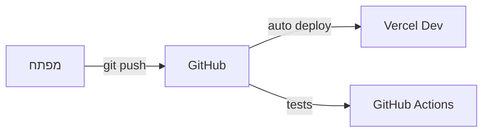
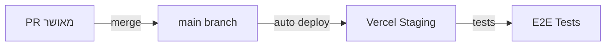
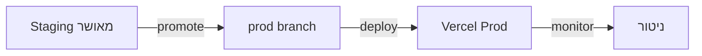

# תהליך הפצה - פרויקט "הדרך" 🚀

## 📋 סקירה כללית

מסמך זה מפרט את תהליך ההפצה המלא של הפרויקט, כולל סביבות, תהליכי CI/CD, ניטור ותחזוקה.

## 🌐 סביבות

### פיתוח (Development)



- **URL**: dev.haderech.com
- **מטרה**: פיתוח ובדיקות מקומיות
- **מאפיינים**:
  - Hot Reload
  - דאטה מדומה
  - כלי פיתוח
  - לוגים מפורטים

### בדיקות (Staging)



- **URL**: staging.haderech.com
- **מטרה**: בדיקות QA ואינטגרציה
- **מאפיינים**:
  - זהה לייצור
  - דאטה אנונימית
  - ניטור מלא
  - בדיקות אוטומטיות

### ייצור (Production)



- **URL**: haderech.com
- **מטרה**: סביבת משתמשי קצה
- **מאפיינים**:
  - ביצועים מקסימליים
  - אבטחה מלאה
  - גיבוי אוטומטי
  - ניטור 24/7

## 🔄 תהליך CI/CD

### אינטגרציה רציפה (CI)

```yaml
# .github/workflows/ci.yml
name: CI Pipeline
on:
  push:
    branches: [main, dev]
  pull_request:
    branches: [main]

jobs:
  test:
    runs-on: ubuntu-latest
    steps:
      - uses: actions/checkout@v2
      - name: Setup Node.js
        uses: actions/setup-node@v3
        with:
          node-version: "18"
      - name: Install pnpm
        uses: pnpm/action-setup@v2
        with:
          version: 8
      - name: Install Dependencies
        run: pnpm install
      - name: Type Check
        run: pnpm run type-check
      - name: Run Tests
        run: pnpm run test
      - name: Run Linting
        run: pnpm run lint:strict
      - name: Build
        run: pnpm run build
```

### הפצה רציפה (CD)

```yaml
# vercel.json
{
  "version": 2,
  "buildCommand": "pnpm run build",
  "devCommand": "pnpm run dev",
  "installCommand": "pnpm install",
  "framework": "nextjs",
  "regions": ["fra1"],
  "env":
    {
      "NEXT_PUBLIC_APP_URL": "@next_public_app_url",
      "NEXT_PUBLIC_SUPABASE_URL": "@next_public_supabase_url",
      "NEXT_PUBLIC_SUPABASE_ANON_KEY": "@next_public_supabase_anon_key",
      "SUPABASE_SERVICE_ROLE_KEY": "@supabase_service_role_key",
      "OPENAI_API_KEY": "@openai_api_key",
      "NEXTAUTH_URL": "@nextauth_url",
      "NEXTAUTH_SECRET": "@nextauth_secret",
    },
  "headers":
    [
      {
        "source": "/(.*)",
        "headers":
          [
            { "key": "X-Content-Type-Options", "value": "nosniff" },
            { "key": "X-Frame-Options", "value": "DENY" },
            { "key": "X-XSS-Protection", "value": "1; mode=block" },
            {
              "key": "Referrer-Policy",
              "value": "strict-origin-when-cross-origin",
            },
          ],
      },
    ],
}
```

## ✅ רשימת תיוג לפני הפצה

### 1. הכנת קוד

- [ ] כל הבדיקות עוברות (`pnpm run test`)
- [ ] אין שגיאות לינטינג (`pnpm run lint:strict`)
- [ ] אין שגיאות טיפוסים (`pnpm run type-check`)
- [ ] הבנייה מצליחה (`pnpm run build`)
- [ ] כל הקבצים נשמרו ונדחפו ל-Git

### 2. הגדרת Vercel

- [ ] פרויקט חדש נוצר ב-Vercel
- [ ] הגדרת משתני סביבה:
  - [ ] `NEXT_PUBLIC_APP_URL`
  - [ ] `NEXT_PUBLIC_SUPABASE_URL`
  - [ ] `NEXT_PUBLIC_SUPABASE_ANON_KEY`
  - [ ] `SUPABASE_SERVICE_ROLE_KEY`
  - [ ] `OPENAI_API_KEY`
  - [ ] `NEXTAUTH_URL`
  - [ ] `NEXTAUTH_SECRET`
- [ ] הגדרת דומיין מותאם אישית
- [ ] הגדרת SSL/TLS
- [ ] הגדרת אזור הפצה (Region)

### 3. בדיקות אבטחה

- [ ] סריקת חולשות אבטחה
- [ ] בדיקת הרשאות API
- [ ] וידוא CORS תקין
- [ ] בדיקת תוקף SSL
- [ ] בדיקת Headers אבטחה

### 4. בדיקות ביצועים

- [ ] ציון Lighthouse מעל 90
- [ ] זמני טעינה תקינים
- [ ] אופטימיזציה לתמונות
- [ ] מטמון תקין
- [ ] בדיקת Core Web Vitals

### 5. בדיקות תוכן

- [ ] תרגומים מלאים
- [ ] תקינות קישורים
- [ ] תקינות תמונות
- [ ] בדיקת נגישות
- [ ] תקינות טפסים

### 6. ניטור והתראות

- [ ] הגדרת Sentry
- [ ] הגדרת Google Analytics
- [ ] הגדרת התראות Slack
- [ ] הגדרת Status Page
- [ ] בדיקת לוגים

## 🔒 אבטחה

### SSL/TLS

- Let's Encrypt אוטומטי
- חידוש אוטומטי
- דירוג A+ ב-SSL Labs

### הגנת תשתית

- WAF (Cloudflare)
- DDoS Protection
- Rate Limiting
- IP Filtering

### אבטחת מידע

- הצפנת נתונים
- גיבוי אוטומטי
- ניטור אבטחה
- GDPR Compliance

## 📊 ניטור וביצועים

### ניטור אפליקציה

```typescript
// monitoring.ts
import * as Sentry from "@sentry/nextjs";

Sentry.init({
  dsn: process.env.SENTRY_DSN,
  tracesSampleRate: 1.0,
  environment: process.env.VERCEL_ENV,
});
```

### מדדי ביצועים

- Core Web Vitals
- זמני תגובה
- שימוש במשאבים
- זמינות מערכת

### התראות

- Slack
- Email
- SMS (קריטי)
- PagerDuty

## 🔄 גיבוי ושחזור

### גיבוי אוטומטי

```sql
-- supabase backup policy
CREATE POLICY "backup_daily" ON storage.objects
  FOR ALL USING (
    scheduled_backup() = true
  );
```

### תדירות

- יומי: גיבוי מלא
- שעתי: גיבוי תוספתי
- מיידי: לפני שינויים קריטיים

### שחזור

- נקודות שחזור
- שחזור סלקטיבי
- בדיקות שחזור תקופתיות

## 🚀 תהליך שחרור

### לפני השחרור

1. בדיקות רגרסיה
2. אישור QA
3. בדיקת ביצועים
4. סקירת אבטחה

### במהלך השחרור

1. גיבוי מלא
2. הפצה הדרגתית
3. ניטור מוגבר
4. צוות כוננות

### אחרי השחרור

1. אימות תקינות
2. בדיקות קצה
3. ניטור משתמשים
4. איסוף משוב

## 🛠️ כלים ושירותים

### תשתית

- Vercel: הפצה ואירוח
- Supabase: בסיס נתונים
- Cloudflare: CDN ואבטחה
- GitHub: קוד ו-CI/CD

### ניטור

- Sentry: ניטור שגיאות
- LogRocket: ניטור משתמשים
- Google Analytics: אנליטיקס
- Uptime Robot: זמינות

### תקשורת

- Slack: תקשורת צוות
- Email: התראות
- Status Page: סטטוס מערכת

## 📝 הערות

- יש לעדכן את תהליך ההפצה בהתאם לשינויים בארכיטקטורה
- חשוב לשמור על תיעוד מעודכן של כל שינוי בתצורה
- נדרש לבצע תרגולי שחזור תקופתיים
- יש לשמור על מדיניות גרסאות ברורה

# תהליך פריסה והעלאה לאוויר

## בדיקות מקדימות

### 1. בדיקות מקומיות

לפני דחיפת שינויים לגיטהאב, יש לבצע את הבדיקות הבאות:

```bash
# בדיקת שגיאות טייפסקריפט
npx tsc --noEmit

# בדיקת לינטר
npm run lint

# בדיקות יחידה
npm run test

# בדיקת טיפוסים
# חיפוש שימוש ב-any ו-unknown
grep -r "any\|unknown" src/

# בנייה מקומית
npm run build
```

### 2. בדיקת תיעוד

- וידוא שכל השינויים מתועדים
- עדכון מסמכי API
- עדכון CHANGELOG
- בדיקת README

### 3. בדיקת תצורה

- בדיקת משתני סביבה
- בדיקת הגדרות Vercel
- בדיקת הגדרות Supabase

## תהליך העלאה

### 1. הכנה

- מיזוג שינויים ל-main
- עדכון מספר גרסה
- תיוג בגיט

### 2. בנייה

- בנייה אוטומטית ב-Vercel
- בדיקת לוגים
- וידוא הצלחת הבנייה

### 3. פריסה

- פריסה אוטומטית לסביבת בדיקות
- בדיקות קבלה
- פריסה לייצור

## בדיקות לאחר פריסה

### 1. בדיקות פונקציונליות

- בדיקת נתיבי ניווט
- בדיקת טפסים
- בדיקת אימות

### 2. בדיקות ביצועים

- בדיקת זמני טעינה
- בדיקת עומסים
- בדיקת זיכרון

### 3. בדיקות אבטחה

- בדיקת HTTPS
- בדיקת הרשאות
- בדיקת אימות

## ניטור

### 1. לוגים

- בדיקת לוגי שרת
- בדיקת לוגי לקוח
- ניתוח שגיאות

### 2. מדדים

- ניטור זמני תגובה
- ניטור שימוש במשאבים
- ניטור שגיאות

### 3. התראות

- הגדרת התראות
- ניטור זמינות
- טיפול בתקלות

## גיבוי ושחזור

### 1. גיבויים

- גיבוי בסיס נתונים
- גיבוי קבצים
- גיבוי הגדרות

### 2. שחזור

- נוהל שחזור
- בדיקות שחזור
- תיעוד תהליכים

## תחזוקה

### 1. עדכונים

- עדכוני אבטחה
- עדכון תלויות
- עדכוני תשתית

### 2. אופטימיזציה

- ניקוי מטמונים
- אופטימיזציה של בסיס נתונים
- אופטימיזציה של קבצים

### 3. תיעוד

- עדכון תיעוד
- תיעוד תקלות
- תיעוד פתרונות

## רשימת תיוג לפני פריסה

### 1. קוד

- [ ] כל הבדיקות המקומיות עברו
- [ ] אין שגיאות טייפסקריפט
- [ ] אין שימוש ב-any/unknown לא מתועד
- [ ] כל הטיפוסים מוגדרים ב-api.ts
- [ ] הבנייה המקומית הצליחה

### 2. תיעוד

- [ ] CHANGELOG מעודכן
- [ ] תיעוד API מעודכן
- [ ] README מעודכן
- [ ] מסמכי פרויקט מעודכנים

### 3. תצורה

- [ ] משתני סביבה מוגדרים
- [ ] הגדרות Vercel נכונות
- [ ] הגדרות Supabase נכונות

### 4. בדיקות

- [ ] בדיקות יחידה עוברות
- [ ] בדיקות אינטגרציה עוברות
- [ ] בדיקות קבלה עוברות

### 5. אבטחה

- [ ] אין חשיפת מידע רגיש
- [ ] הרשאות מוגדרות נכון
- [ ] HTTPS מופעל

### 6. ביצועים

- [ ] זמני טעינה סבירים
- [ ] אופטימיזציה של תמונות
- [ ] מטמונים מוגדרים נכון
