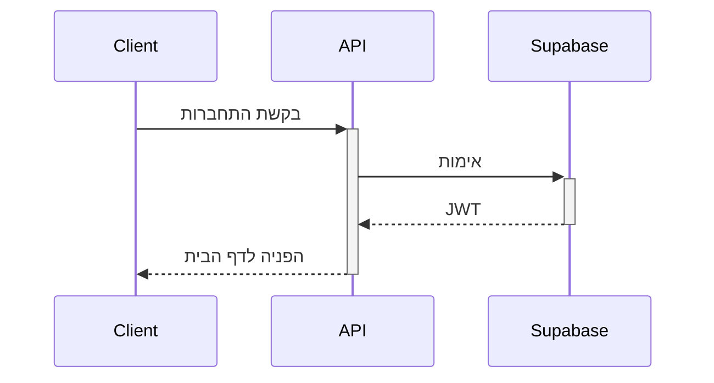
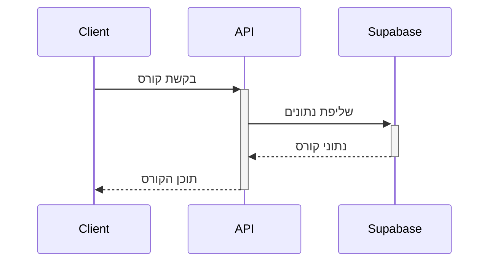
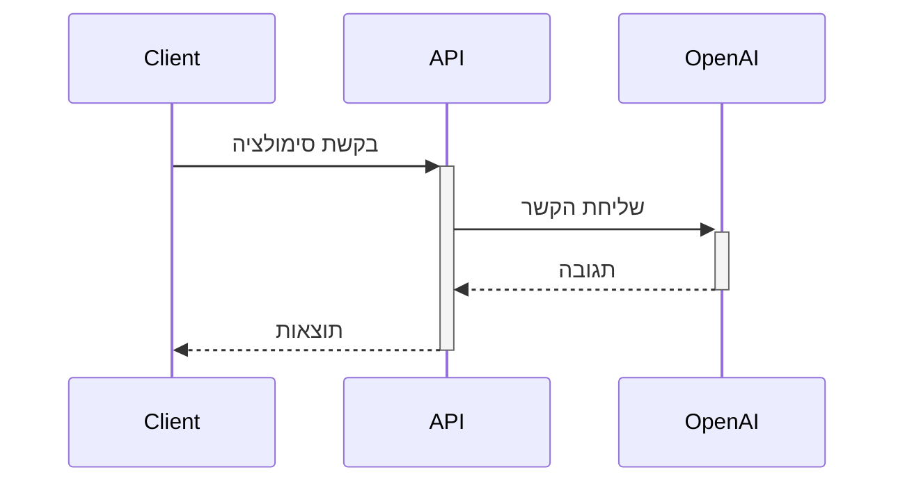

# ארכיטקטורת המערכת

## 🏗️ סקירה כללית

### שכבות המערכת
```
Frontend (Next.js) ←→ API Routes ←→ Supabase ←→ PostgreSQL
                                 ↘→ OpenAI API
```

### מבנה הפרויקט
```
src/
├── app/                    # Next.js App Router
│   ├── api/               # API Routes
│   ├── auth/              # דפי אימות
│   ├── courses/           # דפי קורסים
│   ├── forum/             # דפי פורום
│   └── profile/           # דפי פרופיל
│
├── components/            # React Components
│   ├── ui/               # רכיבי UI בסיסיים
│   ├── course/           # רכיבי קורסים
│   ├── forum/            # רכיבי פורום
│   └── shared/           # רכיבים משותפים
│
├── lib/                   # ספריות ושירותים
│   ├── supabase/         # לוגיקת Supabase
│   ├── openai/           # לוגיקת OpenAI
│   └── utils/            # פונקציות עזר
│
├── types/                 # TypeScript Types
│   ├── api.ts            # טיפוסי API
│   └── supabase.ts       # טיפוסי Supabase
│
├── hooks/                 # React Hooks
├── store/                 # ניהול מצב (Redux)
└── styles/               # סגנונות גלובליים
```

## 🔄 זרימת נתונים

### 1. אימות משתמשים


### 2. צפייה בקורס


### 3. סימולציה


## 🔐 אבטחה

### 1. אימות
- JWT מבוסס Supabase
- הצפנת סיסמאות
- חידוש אוטומטי של טוקנים

### 2. הרשאות
- מערכת RBAC
- הרשאות מבוססות תפקיד
- בקרת גישה לנתונים

### 3. אבטחת מידע
- HTTPS בכל התקשורת
- הצפנת מידע רגיש
- סניטציה של קלט

## 💾 בסיס נתונים

### 1. טבלאות עיקריות
- `users`: משתמשים
- `courses`: קורסים
- `lessons`: שיעורים
- `forum_posts`: פוסטים בפורום
- `notifications`: התראות

### 2. יחסים
- קורס ←→ שיעורים (1:n)
- משתמש ←→ קורסים (n:m)
- פוסט ←→ תגובות (1:n)

### 3. אינדקסים
- אינדקס על `user_id`
- אינדקס על `course_id`
- אינדקס על `created_at`

## 🔄 תהליכים

### 1. CI/CD
- בדיקות אוטומטיות
- בנייה אוטומטית
- פריסה אוטומטית

### 2. ניטור
- לוגים מרכזיים
- התראות בזמן אמת
- מדדי ביצועים

### 3. גיבויים
- גיבוי יומי
- שמירת היסטוריה
- שחזור מהיר

## 📈 ביצועים

### 1. אופטימיזציה
- קישור SSR/SSG
- מטמון תוצאות
- דחיסת תמונות

### 2. מדדי ביצועים
- זמן טעינה < 2 שניות
- ציון Lighthouse > 90
- זמן תגובה < 100ms

### 3. מטמון
- מטמון בצד שרת
- מטמון בצד לקוח
- מטמון CDN

## 🔄 שדרוגים עתידיים

### 1. פיצ'רים
- [ ] למידה מותאמת אישית
- [ ] ניתוח התקדמות
- [ ] המלצות חכמות

### 2. טכני
- [ ] GraphQL API
- [ ] WebSocket
- [ ] PWA

### 3. תשתית
- [ ] Kubernetes
- [ ] Microservices
- [ ] Edge Computing 