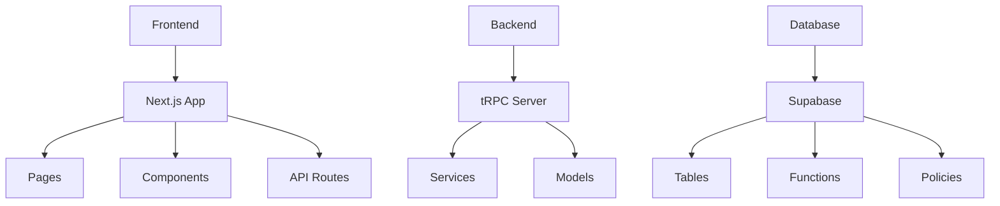
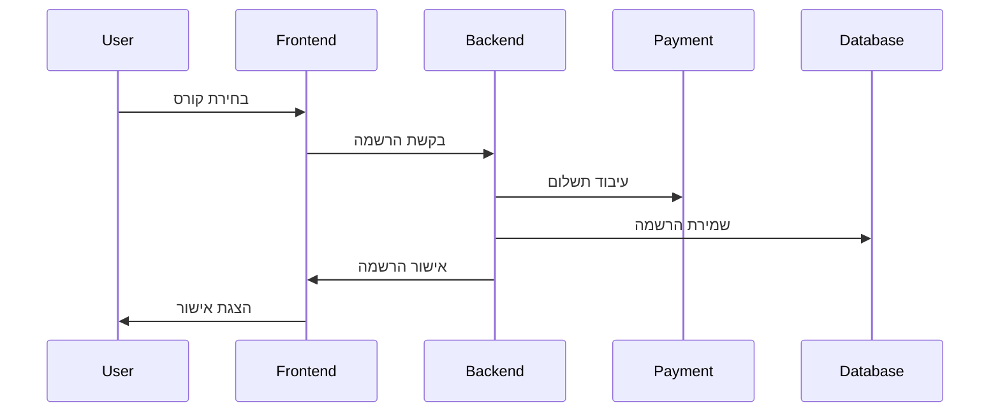
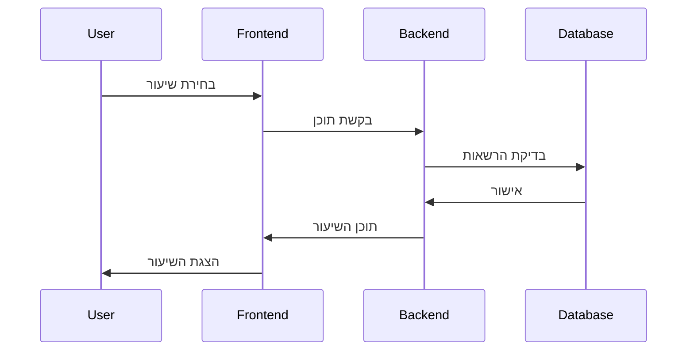

# מפת הפרויקט - HaDerech Next 🗺️

## סקירה כללית 📋

מסמך זה מספק מבט-על על פרויקט הדרך, כולל מבנה, קשרים, ותלויות בין רכיבי המערכת השונים.

## מבנה הפרויקט 🏗️



## רכיבי המערכת 🔧

### 1. Frontend
- **Pages**: דפי האפליקציה
  - `/`: דף הבית
  - `/courses`: קטלוג קורסים
  - `/course/[id]`: דף קורס
  - `/profile`: פרופיל משתמש
  - `/admin`: ממשק ניהול

- **Components**: רכיבים משותפים
  - `Layout`: תבנית בסיסית
  - `Navigation`: ניווט
  - `CourseCard`: כרטיס קורס
  - `UserProfile`: פרופיל משתמש
  - `AdminPanel`: פאנל ניהול

### 2. Backend
- **Services**: שירותי המערכת
  - `AuthService`: אימות משתמשים
  - `CourseService`: ניהול קורסים
  - `UserService`: ניהול משתמשים
  - `PaymentService`: תשלומים
  - `AnalyticsService`: אנליטיקס

- **Models**: מודלים
  - `User`: משתמש
  - `Course`: קורס
  - `Lesson`: שיעור
  - `Progress`: התקדמות
  - `Payment`: תשלום

### 3. Database
- **Tables**: טבלאות
  - `users`: משתמשים
  - `courses`: קורסים
  - `lessons`: שיעורים
  - `progress`: התקדמות
  - `payments`: תשלומים

## תלויות ותקשורת 🔄

### 1. Frontend-Backend
```typescript
// API Call Example
const getCourse = async (id: string) => {
  const course = await trpc.course.get.query({ id });
  return course;
};
```

### 2. Backend-Database
```typescript
// Database Query Example
const getUserCourses = async (userId: string) => {
  const { data, error } = await supabase
    .from('courses')
    .select('*')
    .eq('user_id', userId);
  return data;
};
```

## תהליכים עיקריים 🔄

### 1. הרשמה לקורס


### 2. צפייה בשיעור


## אינטגרציות 🔌

### 1. שירותים חיצוניים
- Stripe: תשלומים
- OpenAI: AI Assistant
- SendGrid: אימיילים
- Cloudinary: מדיה
- Sentry: ניטור

### 2. כלי פיתוח
- GitHub: קוד
- Vercel: אירוח
- Jest: בדיקות
- ESLint: לינטינג
- Prettier: פורמטינג

## ניטור וביצועים 📊

### 1. מדדי ביצוע
```typescript
// Performance Monitoring
const trackPerformance = () => {
  const metrics = {
    pageLoad: performance.now(),
    memory: performance.memory,
    resources: performance.getEntriesByType('resource'),
  };
  sendToAnalytics(metrics);
};
```

### 2. לוגים ושגיאות
```typescript
// Error Tracking
const errorHandler = (error: Error) => {
  logger.error({
    message: error.message,
    stack: error.stack,
    timestamp: new Date(),
  });
};
```

## אבטחה 🔒

### 1. הרשאות
```typescript
// Permission Check
const checkAccess = async (userId: string, courseId: string) => {
  const hasAccess = await supabase
    .from('enrollments')
    .select('*')
    .match({ user_id: userId, course_id: courseId });
  return hasAccess.data?.length > 0;
};
```

### 2. אימות
```typescript
// Authentication
const requireAuth = async (req: NextApiRequest) => {
  const session = await getSession({ req });
  if (!session) throw new Error('Unauthorized');
  return session;
};
```

## תחזוקה ועדכונים 🔧

### 1. גיבויים
```bash
# Database Backup
pg_dump -U postgres -d haderech > backup.sql
```

### 2. עדכוני תשתית
```bash
# Dependencies Update
npm update --save
```

## סיכום 📝

### מטרות
1. ארכיטקטורה מודולרית
2. תקשורת יעילה
3. אבטחה גבוהה
4. ביצועים מעולים
5. תחזוקה פשוטה

### המלצות
1. שיפור תיעוד
2. הרחבת בדיקות
3. אופטימיזציה
4. שדרוג אבטחה
5. הוספת ניטור 