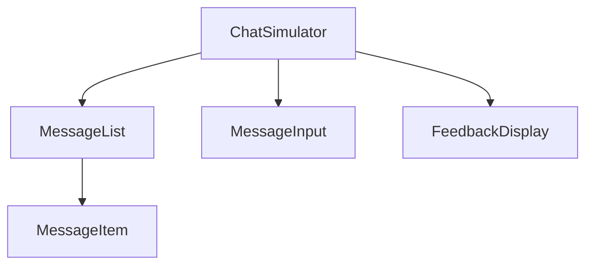

# 🤖 סימולטור תרגול - תיעוד טכני

## 🎯 סקירה כללית

סימולטור התרגול הוא מערכת אינטראקטיבית המאפשרת למשתמשים לתרגל תקשורת ומיומנויות שונות באמצעות AI. המערכת מספקת משוב בזמן אמת ומדדי התקדמות מפורטים.

## 🏗 ארכיטקטורה

### רכיבים עיקריים



### שירותים

- `SimulatorService` - ניהול הסימולציה
- `FeedbackService` - ניתוח וייצור משוב
- `OpenAIService` - תקשורת עם OpenAI
- `DatabaseService` - שמירת נתונים

## 🔧 API

### startSimulation

מתחיל סימולציה חדשה.

```typescript
async function startSimulation(
  scenario: SimulatorScenario,
  userId: string
): Promise<SimulatorSession>;
```

#### פרמטרים:

- `scenario` - תרחיש הסימולציה
- `userId` - מזהה המשתמש

#### דוגמה:

```typescript
const session = await startSimulation(
  {
    id: "scenario-1",
    title: "תרחיש לדוגמה",
    // ...
  },
  "user-123"
);
```

### processUserMessage

מעבד הודעת משתמש ומחזיר מצב מעודכן.

```typescript
async function processUserMessage(
  session: SimulatorSession,
  content: string
): Promise<SimulatorState>;
```

#### פרמטרים:

- `session` - מצב נוכחי של הסימולציה
- `content` - תוכן ההודעה

#### דוגמה:

```typescript
const state = await processUserMessage(session, "שלום, אני צריך עזרה");
```

### saveSimulationResults

שומר את תוצאות הסימולציה.

```typescript
async function saveSimulationResults(state: SimulatorSession): Promise<void>;
```

#### פרמטרים:

- `state` - מצב הסימולציה לשמירה

#### דוגמה:

```typescript
await saveSimulationResults(session);
```

## 📊 מדדי משוב

### FeedbackMetrics

```typescript
interface FeedbackMetrics {
  empathy: number; // 0-100
  clarity: number; // 0-100
  effectiveness: number; // 0-100
  appropriateness: number; // 0-100
  professionalism: number; // 0-100
  problem_solving: number; // 0-100
  overall: number; // 0-100
}
```

### חישוב ציונים

```typescript
const SCORE_WEIGHTS = {
  empathy: 0.2,
  clarity: 0.2,
  effectiveness: 0.2,
  appropriateness: 0.15,
  professionalism: 0.15,
  problem_solving: 0.1,
};
```

## 🔒 אבטחה

### וולידציית קלט

- בדיקת אורך מקסימלי
- סניטציה של HTML
- מניעת SQL Injection
- מניעת Command Injection

### הגבלות

- Rate Limiting: 20 הודעות לדקה
- גודל הודעה מקסימלי: 1000 תווים
- מספר הודעות מקסימלי: 100 לסימולציה

### הרשאות

- אימות משתמש נדרש
- בדיקת תוקף סשן
- הגנת CSRF

## ⚡ ביצועים

### מדדים

- זמן תגובה: < 500ms
- שימוש בזיכרון: < 50MB
- CPU: < 30%
- רוחב פס: < 1MB/s

### אופטימיזציות

- Caching של תגובות
- Lazy Loading של הודעות
- דחיסת תוכן
- Batch Processing

## 🧪 בדיקות

### יחידה

```bash
npm test simulator
```

### ביצועים

```bash
npm test:perf simulator
```

### אבטחה

```bash
npm test:security simulator
```

### נגישות

```bash
npm test:a11y simulator
```

## 📱 ממשק משתמש

### קומפוננטות

- `ChatSimulator` - קומפוננטת הבסיס
- `MessageList` - רשימת הודעות
- `MessageItem` - הודעה בודדת
- `FeedbackDisplay` - תצוגת משוב

### נגישות

- תמיכה מלאה ב-ARIA
- ניווט מקלדת
- תמיכה בקורא מסך
- RTL מובנה

## 🔄 תהליך פיתוח

### Pre-commit

1. Linting
2. Type Check
3. Unit Tests
4. Build Check

### Pre-merge

1. Integration Tests
2. Performance Tests
3. Security Tests
4. Accessibility Tests

## 📚 דוגמאות

### יצירת סימולציה

```typescript
const scenario: SimulatorScenario = {
  id: "1",
  title: "תרחיש לדוגמה",
  description: "תרחיש בסיסי לתרגול תקשורת",
  difficulty: "beginner",
  category: "תקשורת",
  tags: ["תקשורת", "אמפתיה"],
  initial_message: "שלום, איך אני יכול לעזור?",
  learning_objectives: ["שיפור תקשורת"],
  success_criteria: {
    minScore: 70,
    requiredSkills: ["תקשורת"],
    minDuration: 300,
    maxDuration: 900,
  },
  created_at: new Date().toISOString(),
  updated_at: new Date().toISOString(),
};

const session = await startSimulation(scenario, userId);
```

### שליחת הודעה

```typescript
const state = await processUserMessage(session, "שלום, אני צריך עזרה");
console.log(state.feedback?.score); // ציון המשוב
console.log(state.feedback?.suggestions); // הצעות לשיפור
```

### שמירת תוצאות

```typescript
await saveSimulationResults(session);
```

## 🐛 טיפול בשגיאות

### סוגי שגיאות

- `ValidationError` - שגיאת וולידציה
- `AuthenticationError` - שגיאת אימות
- `RateLimitError` - חריגה ממגבלת קצב
- `DatabaseError` - שגיאת מסד נתונים

### דוגמה לטיפול

```typescript
try {
  await processUserMessage(session, message);
} catch (error) {
  if (error instanceof ValidationError) {
    // טיפול בשגיאת וולידציה
  } else if (error instanceof RateLimitError) {
    // טיפול בחריגה ממגבלת קצב
  }
}
```

## 📈 ניטור

### מדדים

- זמני תגובה
- שימוש במשאבים
- שגיאות
- פעילות משתמשים

### התראות

- חריגה ממגבלות
- שגיאות קריטיות
- בעיות ביצועים
- חריגות אבטחה

## 🔄 תחזוקה

### משימות תקופתיות

- ניקוי נתונים ישנים
- עדכון מודלים
- אופטימיזציית ביצועים
- עדכון תלויות

### גיבוי

- גיבוי יומי של נתונים
- גיבוי שבועי של מודלים
- גיבוי חודשי של הגדרות
