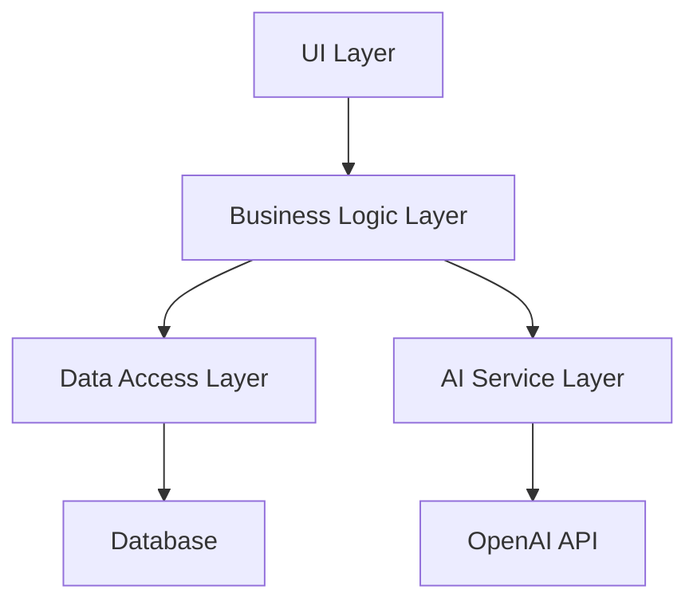

# 🛠 תהליך פיתוח הסימולטור

## 🎯 סקירה כללית

תהליך הפיתוח של הסימולטור מתבסס על עקרונות של פיתוח מונחה בדיקות (TDD), ארכיטקטורת מיקרו-שירותים, ותהליכי CI/CD מתקדמים.

## 🏗 ארכיטקטורה

### שכבות המערכת



### מיקרו-שירותים

- **SimulatorService**: ניהול הסימולציה
- **FeedbackService**: ניתוח וייצור משוב
- **ScenarioService**: ניהול תרחישים
- **ProgressService**: מעקב התקדמות

## 📝 תהליך פיתוח

### 1. תכנון

- אפיון דרישות
- תכנון ארכיטקטורה
- הגדרת ממשקים
- תכנון בדיקות

### 2. פיתוח

- כתיבת בדיקות
- מימוש פונקציונליות
- סקירת קוד
- אינטגרציה

### 3. בדיקות

- בדיקות יחידה
- בדיקות אינטגרציה
- בדיקות ביצועים
- בדיקות אבטחה

### 4. פריסה

- בדיקות קבלה
- פריסה הדרגתית
- ניטור
- משוב משתמשים

## 🧪 תהליך בדיקות

### בדיקות יחידה

```typescript
describe("SimulatorService", () => {
  it("should start new simulation", async () => {
    const service = new SimulatorService();
    const session = await service.startSimulation(mockScenario, "user-1");
    expect(session).toBeDefined();
    expect(session.status).toBe("active");
  });

  it("should process user message", async () => {
    const service = new SimulatorService();
    const response = await service.processUserMessage(mockSession, "test");
    expect(response.messages).toHaveLength(2);
  });
});
```

### בדיקות אינטגרציה

```typescript
describe("Simulator Integration", () => {
  it("should complete full simulation flow", async () => {
    const simulator = new SimulatorService();
    const feedback = new FeedbackService();

    const session = await simulator.startSimulation(mockScenario, "user-1");
    const response = await simulator.processUserMessage(session, "test");
    const result = await feedback.generateFeedback(response.messages);

    expect(result.score).toBeGreaterThan(0);
  });
});
```

## 🔄 תהליך CI/CD

### Pipeline

```yaml
name: Simulator CI/CD

on:
  push:
    branches: [main]
  pull_request:
    branches: [main]

jobs:
  test:
    runs-on: ubuntu-latest
    steps:
      - uses: actions/checkout@v2
      - name: Install dependencies
        run: npm install
      - name: Run tests
        run: npm test simulator
      - name: Run performance tests
        run: npm test:perf simulator
      - name: Run security tests
        run: npm test:security simulator

  deploy:
    needs: test
    runs-on: ubuntu-latest
    steps:
      - name: Deploy to staging
        run: npm run deploy:staging
      - name: Run smoke tests
        run: npm run test:smoke
      - name: Deploy to production
        if: success()
        run: npm run deploy:prod
```

## 📊 ניטור וביצועים

### מדדי ביצוע

```typescript
interface PerformanceMetrics {
  responseTime: number; // ms
  memoryUsage: number; // MB
  cpuUsage: number; // %
  concurrentUsers: number;
  errorRate: number; // %
}

const performanceThresholds = {
  responseTime: 500, // max ms
  memoryUsage: 50, // max MB
  cpuUsage: 30, // max %
  errorRate: 1, // max %
};
```

### ניטור בזמן אמת

```typescript
class PerformanceMonitor {
  async trackMetrics(session: SimulatorSession): Promise<void> {
    const startTime = performance.now();

    try {
      // מדידת ביצועים
      const metrics: PerformanceMetrics = {
        responseTime: performance.now() - startTime,
        memoryUsage: process.memoryUsage().heapUsed / 1024 / 1024,
        cpuUsage: await getCPUUsage(),
        concurrentUsers: await getActiveUsers(),
        errorRate: await getErrorRate(),
      };

      // שמירת המדדים
      await saveMetrics(metrics);

      // בדיקת חריגות
      this.checkThresholds(metrics);
    } catch (error) {
      console.error("Performance monitoring error:", error);
    }
  }

  private checkThresholds(metrics: PerformanceMetrics): void {
    if (metrics.responseTime > performanceThresholds.responseTime) {
      this.alertSlowResponse(metrics.responseTime);
    }
    // בדיקות נוספות...
  }
}
```

## 🔒 אבטחה

### בדיקות אבטחה

```typescript
describe("Security Tests", () => {
  it("should validate input", async () => {
    const service = new SimulatorService();
    const maliciousInput = "<script>alert('xss')</script>";

    await expect(
      service.processUserMessage(mockSession, maliciousInput)
    ).rejects.toThrow();
  });

  it("should enforce rate limiting", async () => {
    const service = new SimulatorService();
    const requests = Array(20).fill("test message");

    const results = await Promise.allSettled(
      requests.map((msg) => service.processUserMessage(mockSession, msg))
    );

    expect(
      results.filter((r) => r.status === "rejected")
    ).toHaveLength.greaterThan(0);
  });
});
```

## 📱 פיתוח ממשק משתמש

### קומפוננטות

```typescript
// ChatSimulator.tsx
export function ChatSimulator({ session, onMessage }: ChatSimulatorProps) {
  return (
    <div className="chat-simulator" role="main">
      <MessageList messages={session.messages} />
      <MessageInput onSend={onMessage} />
      <FeedbackDisplay feedback={session.feedback} />
    </div>
  );
}

// MessageList.tsx
export function MessageList({ messages }: MessageListProps) {
  return (
    <div className="message-list" role="log">
      {messages.map(message => (
        <MessageItem key={message.id} message={message} />
      ))}
    </div>
  );
}
```

### נגישות

```typescript
// FeedbackDisplay.tsx
export function FeedbackDisplay({ feedback }: FeedbackDisplayProps) {
  return (
    <div
      className="feedback-display"
      role="complementary"
      aria-label="משוב על הביצועים"
    >
      <div role="status" aria-live="polite">
        <p>ציון: {feedback.score}</p>
        <p>רמה: {feedback.overallProgress.level}</p>
      </div>
      <div role="list" aria-label="חוזקות">
        {feedback.strengths.map(strength => (
          <div key={strength} role="listitem">{strength}</div>
        ))}
      </div>
    </div>
  );
}
```

## 📚 תיעוד API

### OpenAPI Spec

```yaml
openapi: 3.0.0
info:
  title: Simulator API
  version: 1.0.0
paths:
  /simulations:
    post:
      summary: Start new simulation
      requestBody:
        required: true
        content:
          application/json:
            schema:
              $ref: "#/components/schemas/SimulationRequest"
      responses:
        "200":
          description: Simulation started successfully
          content:
            application/json:
              schema:
                $ref: "#/components/schemas/SimulationSession"
```

## 🔄 תחזוקה

### משימות שוטפות

1. עדכון תלויות
2. ניקוי נתונים
3. אופטימיזציה
4. גיבוי

### ניטור שגיאות

```typescript
class ErrorMonitor {
  async trackError(error: Error, context: any): Promise<void> {
    await saveError({
      message: error.message,
      stack: error.stack,
      context,
      timestamp: new Date().toISOString(),
    });

    if (this.isCritical(error)) {
      await this.notifyTeam(error);
    }
  }
}
```
