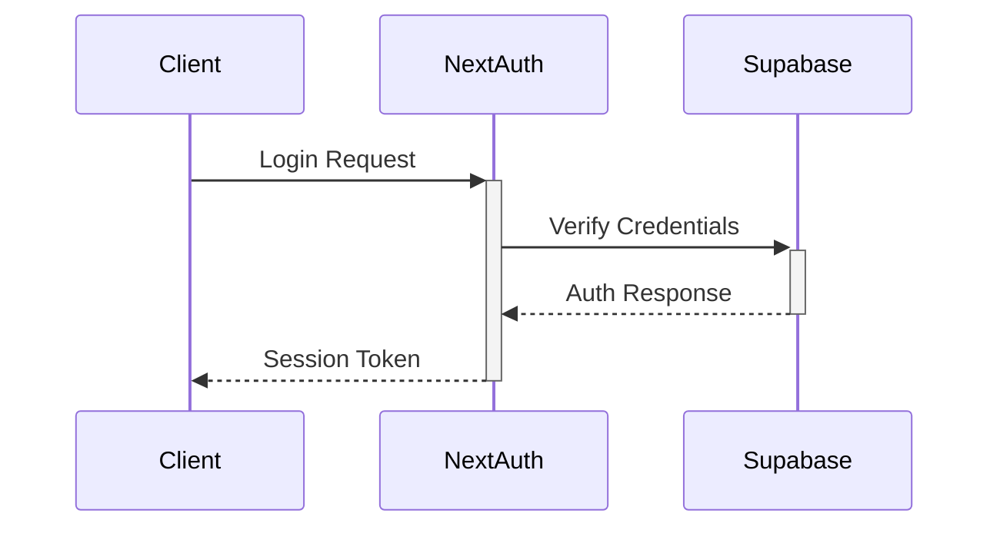
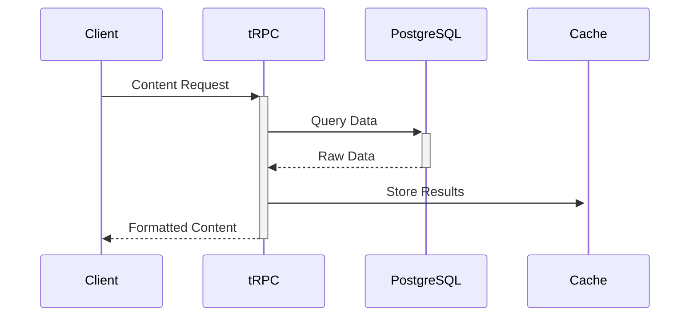
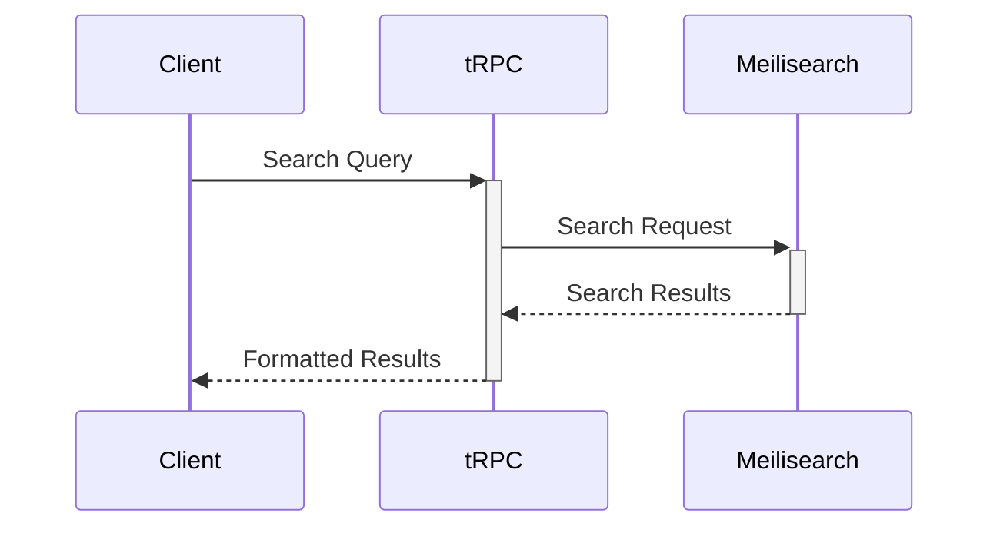

# ארכיטקטורת המערכת

## 🏗️ סקירה כללית

הדרך היא פלטפורמת למידה מתקדמת המבוססת על ארכיטקטורת מיקרו-שירותים מודרנית. המערכת בנויה באופן מודולרי ומדרגי, המאפשר גמישות מקסימלית והרחבה עתידית.

## 🔧 רכיבים עיקריים

### 1. Frontend (Next.js)
- **Framework**: Next.js 14
- **State Management**: Zustand
- **UI Components**: Shadcn/ui
- **Styling**: Tailwind CSS
- **Forms**: React Hook Form
- **Validation**: Zod
- **API Client**: tRPC

### 2. Backend (Node.js)
- **Runtime**: Node.js 20
- **API Framework**: tRPC
- **Authentication**: NextAuth.js
- **Validation**: Zod
- **Task Queue**: Bull
- **Caching**: Redis
- **Search**: Meilisearch

### 3. Database (Supabase)
- **Primary DB**: PostgreSQL
- **Real-time**: Supabase Realtime
- **Storage**: Supabase Storage
- **Cache**: Redis
- **Search**: Meilisearch

### 4. Infrastructure
- **Hosting**: Vercel
- **CDN**: Vercel Edge Network
- **Storage**: Supabase Storage
- **Monitoring**: Sentry
- **Analytics**: Posthog
- **CI/CD**: GitHub Actions

## 🔄 תהליכי ליבה

### 1. אימות משתמשים


### 2. ניהול תוכן


### 3. חיפוש


## 📊 מודלים

### 1. User
```typescript
interface User {
  id: string;
  email: string;
  name: string;
  role: UserRole;
  preferences: UserPreferences;
  progress: LearningProgress;
}
```

### 2. Course
```typescript
interface Course {
  id: string;
  title: string;
  description: string;
  modules: Module[];
  prerequisites: Course[];
  metadata: CourseMetadata;
}
```

### 3. Module
```typescript
interface Module {
  id: string;
  courseId: string;
  title: string;
  content: Content[];
  exercises: Exercise[];
  quizzes: Quiz[];
}
```

## 🔐 אבטחה

### 1. אימות
- NextAuth.js לניהול הרשאות
- JWT מאובטח
- 2FA (מתוכנן)
- OAuth providers

### 2. הרשאות
- RBAC (Role-Based Access Control)
- Row Level Security בדאטהבייס
- Middleware לאימות בקשות

### 3. אבטחת מידע
- הצפנת מידע רגיש
- HTTPS בלבד
- Rate limiting
- CORS מוגדר

## 📈 ביצועים

### 1. Frontend
- SSR לדפים דינמיים
- ISR לתוכן סטטי
- Code splitting אוטומטי
- Lazy loading לתמונות

### 2. Backend
- Caching מרובד
- Connection pooling
- Query optimization
- Background jobs

### 3. Database
- Materialized views
- Indexing מותאם
- Query caching
- Sharding (מתוכנן)

## 🔄 CI/CD

### 1. בדיקות
- Unit tests (Jest)
- Integration tests (Cypress)
- E2E tests (Playwright)
- Type checking (TypeScript)

### 2. Deployment
- GitHub Actions
- Vercel deployments
- Database migrations
- Rollback אוטומטי

### 3. ניטור
- Sentry לשגיאות
- Posthog לאנליטיקס
- Uptime monitoring
- Performance metrics

## 📱 Progressive Web App

### 1. תכונות
- Offline support
- Push notifications
- App-like experience
- Auto-updates

### 2. Performance
- Caching strategies
- Background sync
- Lazy loading
- Compression

## 🌐 Scalability

### 1. אופקי
- Load balancing
- Stateless services
- Distributed caching
- Database sharding

### 2. אנכי
- Resource optimization
- Query optimization
- Caching strategies
- Background processing

## 📝 סיכום

הארכיטקטורה של הדרך מתוכננת לספק:
- ביצועים מעולים
- אבטחה גבוהה
- יכולת הרחבה
- תחזוקה פשוטה
- חווית משתמש מעולה 