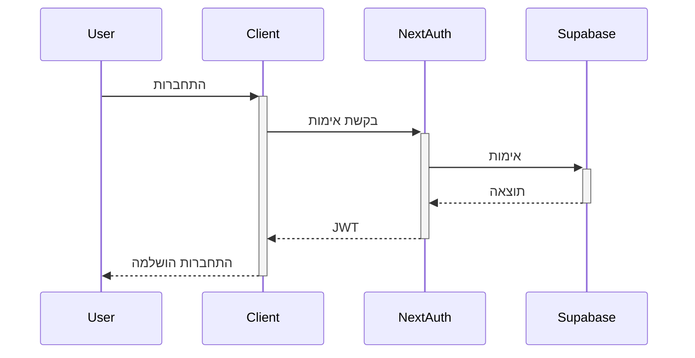
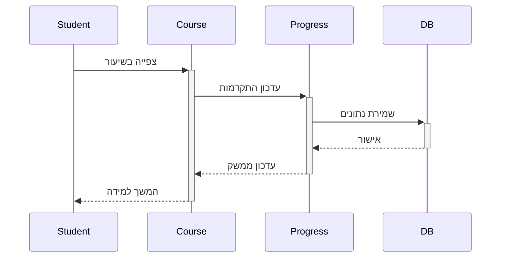

# 🏗️ ארכיטקטורת המערכת

## 📋 סקירה כללית

HaDerech היא פלטפורמת למידה מתקדמת המבוססת על Next.js 14, React 18, ו-TypeScript. המערכת משתמשת ב-Supabase כ-Backend וכוללת מספר מודולים עיקריים:

## 🔄 תרשים ארכיטקטורה

```mermaid
graph TD
    Client[לקוח - Next.js App] --> API[API Layer]
    API --> Auth[Authentication - NextAuth.js]
    API --> DB[Database - Supabase]
    API --> AI[AI Services - OpenAI]
    API --> Storage[Storage - Supabase Storage]

    subgraph Core Modules
        Courses[מערכת קורסים]
        Forum[פורום קהילתי]
        Simulator[סימולטור תרגול]
        Progress[מעקב התקדמות]
    end

    Client --> Core Modules
```

## 🧱 רכיבים עיקריים

### 1. שכבת לקוח (Frontend)

- **Next.js 14 App Router**
  - Server Components
  - Client Components
  - API Routes
- **React 18**
  - Hooks מותאמים אישית
  - Context Providers
  - Redux לניהול מצב
- **UI Components**
  - Radix UI
  - Tailwind CSS
  - Framer Motion

### 2. שכבת שרת (Backend)

- **Supabase**
  - PostgreSQL Database
  - Authentication
  - Real-time Subscriptions
  - Storage
- **API Routes**
  - RESTful Endpoints
  - Serverless Functions
  - Middleware

### 3. שירותי AI

- **OpenAI Integration**
  - GPT-4 for Simulator
  - Embeddings for Search
  - Content Generation
- **Custom ML Models**
  - Progress Tracking
  - Recommendations
  - Performance Analysis

## 📊 זרימת מידע

### 1. אימות משתמשים



### 2. תהליך למידה



## 🔗 תלויות חיצוניות

### 1. שירותי ענן

- Vercel (אירוח)
- Supabase (מסד נתונים)
- OpenAI (AI)
- AWS S3 (גיבוי)

### 2. ספריות עיקריות

- Next.js
- React
- TypeScript
- Tailwind CSS
- Radix UI
- Redux Toolkit
- Prisma
- OpenAI SDK

## 🔒 אבטחה

### 1. שכבות הגנה

- JWT Authentication
- Row Level Security (RLS)
- API Rate Limiting
- CORS Policies

### 2. הצפנה

- SSL/TLS
- הצפנת נתונים רגישים
- Secure Headers

## 📈 ביצועים

### 1. אופטימיזציה

- Server-Side Rendering
- Static Generation
- Image Optimization
- Code Splitting

### 2. מטמון

- Redis Cache
- Browser Cache
- Static Assets CDN

## 🔄 Scalability

### 1. אופקי

- Load Balancing
- Distributed Caching
- Database Sharding

### 2. אנכי

- Resource Optimization
- Database Indexing
- Query Optimization

## 📚 מסמכים קשורים

- [API Documentation](../api/README.md)
- [Database Schema](../database/README.md)
- [Deployment Guide](../../deployment/README.md)
