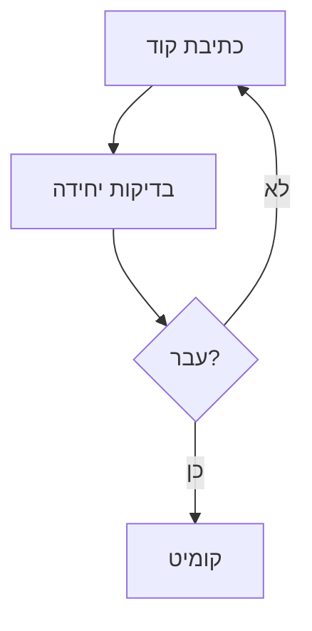
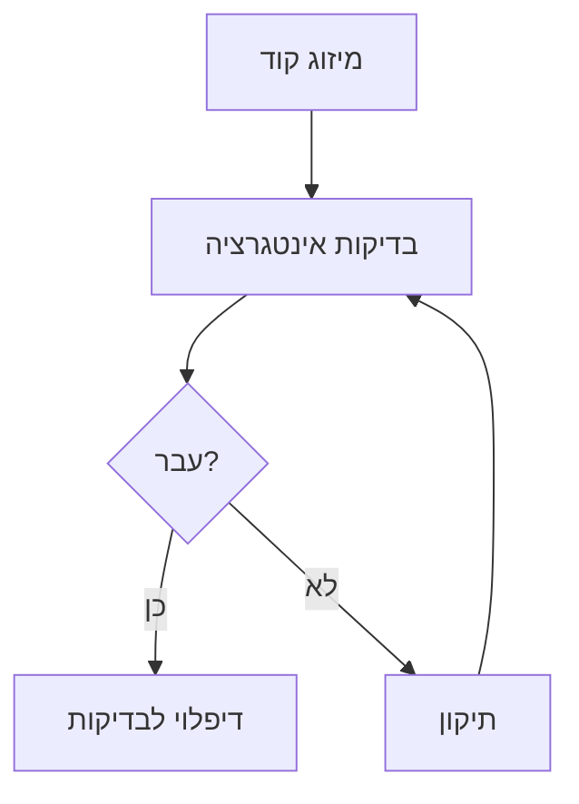
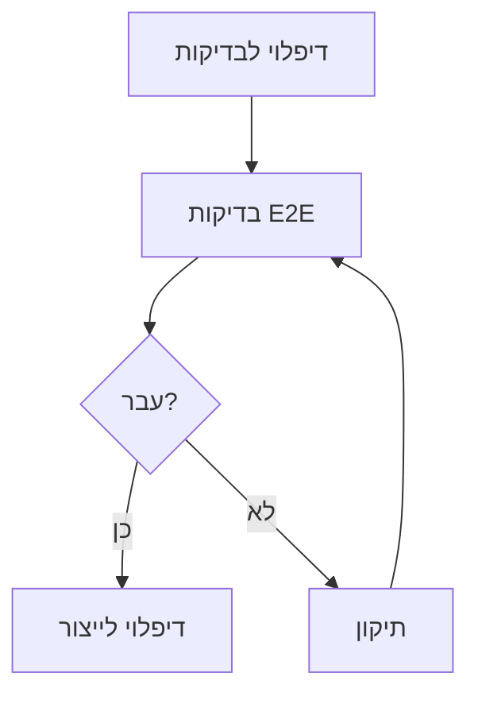

# תוכנית בדיקות - פרויקט "הדרך" 🧪

## 📋 סקירה כללית
מסמך זה מפרט את אסטרטגיית הבדיקות של הפרויקט, כולל סוגי בדיקות, כלים, תהליכים ומדדי הצלחה.

## 🎯 מטרות
1. וידוא איכות ואמינות המערכת
2. זיהוי באגים מוקדם ככל האפשר
3. הבטחת חווית משתמש מיטבית
4. עמידה בדרישות אבטחה ופרטיות
5. וידוא ביצועים ויציבות

## 🔄 תהליך הבדיקות

### שלב 1: בדיקות יחידה


### שלב 2: בדיקות אינטגרציה


### שלב 3: בדיקות E2E


## 📊 סוגי בדיקות

### בדיקות יחידה
- **כלים**: Jest, React Testing Library
- **כיסוי נדרש**: 80%
- **תדירות**: בכל קומיט

#### תבניות בדיקה
\`\`\`typescript
// דוגמה לבדיקת קומפוננטה
describe('AuthComponent', () => {
  it('should render login form', () => {
    render(<AuthComponent />);
    expect(screen.getByRole('form')).toBeInTheDocument();
  });

  it('should handle login submission', async () => {
    render(<AuthComponent />);
    await userEvent.click(screen.getByRole('button'));
    expect(handleSubmit).toHaveBeenCalled();
  });
});
\`\`\`

### בדיקות אינטגרציה
- **כלים**: Cypress
- **כיסוי נדרש**: 70%
- **תדירות**: בכל PR

#### תרחישי בדיקה
1. תהליך הרשמה מלא
2. תהליך התחברות
3. צפייה והתקדמות בקורס
4. אינטראקציה בפורום
5. שימוש במערכת ההמלצות

### בדיקות E2E
- **כלים**: Playwright
- **כיסוי נדרש**: 60%
- **תדירות**: לפני כל דיפלוי לייצור

#### תרחישי בדיקה
1. הרשמה → התחברות → צפייה בקורס → השלמת מבחן
2. התחברות → פרסום בפורום → תגובה → עריכה
3. התחברות → עדכון פרופיל → שינוי הגדרות
4. הרשמה → אימות → שחזור סיסמה

## 🎯 בדיקות לפי תכונות

### אימות והרשאות
- [x] הרשמה והתחברות בסיסית
  ```typescript
  test('user registration flow', async () => {
    // בדיקת הרשמה תקינה
    // בדיקת שגיאות
    // בדיקת ולידציה
  });
  ```

- [ ] אימות דו-שלבי
  ```typescript
  test('2FA flow', async () => {
    // בדיקת שליחת קוד
    // בדיקת אימות
    // בדיקת שגיאות
  });
  ```

### מערכת למידה
- [x] צפייה בקורסים
  ```typescript
  test('course viewing', async () => {
    // בדיקת טעינת וידאו
    // בדיקת מעבר בין שיעורים
    // בדיקת שמירת התקדמות
  });
  ```

- [ ] מעקב התקדמות
  ```typescript
  test('progress tracking', async () => {
    // בדיקת עדכון התקדמות
    // בדיקת חישוב אחוזים
    // בדיקת סנכרון נתונים
  });
  ```

## 📱 בדיקות מכשירים

### נייד
- רזולוציות: 320px, 375px, 414px
- דפדפנים: Chrome, Safari
- מחוות: tap, swipe, pinch
- התראות: push, offline

### טאבלט
- רזולוציות: 768px, 1024px
- דפדפנים: Chrome, Safari, Firefox
- מחוות: stylus, multi-touch
- מצב: portrait, landscape

### דסקטופ
- רזולוציות: 1366px, 1920px
- דפדפנים: Chrome, Firefox, Edge, Safari
- קלט: מקלדת, עכבר
- חלונות: מרובים, מינימום/מקסימום

## 🔍 בדיקות ביצועים

### מדדי Core Web Vitals
- LCP < 2.5s
- FID < 100ms
- CLS < 0.1

### בדיקות עומסים
- **כלים**: k6, Artillery
- **תרחישים**:
  1. 1000 משתמשים בו-זמנית
  2. 100 עדכוני התקדמות/שנייה
  3. 50 הודעות בפורום/שנייה

## 🔒 בדיקות אבטחה

### סריקות אבטחה
- **כלים**: OWASP ZAP, SonarQube
- **תדירות**: שבועית
- **תחומים**:
  1. SQL Injection
  2. XSS
  3. CSRF
  4. Authentication Bypass

### בדיקות תאימות
- GDPR
- WCAG 2.1 AA
- COPPA

## 📈 מדדי הצלחה

### כיסוי בדיקות
- יחידה: 80%
- אינטגרציה: 70%
- E2E: 60%

### יעדי ביצועים
- זמן טעינה: < 3 שניות
- זמן תגובה: < 200ms
- זמינות: 99.9%

### איכות קוד
- Bugs: 0 (Critical/High)
- Technical Debt: < 5%
- Duplications: < 3%

## 🛠️ כלים ותשתיות

### פיתוח
- Jest
- React Testing Library
- Cypress
- Playwright

### CI/CD
- GitHub Actions
- Vercel
- SonarQube

### ניטור
- Sentry
- LogRocket
- Google Analytics

## 📝 הערות
- יש לעדכן את תוכנית הבדיקות בהתאם לשינויים בדרישות
- חשוב לשמור על איזון בין כיסוי לזמן ריצה
- יש לתעד כל באג ופתרון במערכת המעקב
- נדרש לבצע בדיקות רגרסיה לפני כל שחרור

## בדיקות יחידה (Unit Tests) 🔬

### קומפוננטות UI
1. **CourseContent**
   ```typescript
   describe('CourseContent', () => {
     it('should display course lessons correctly')
     it('should show locked state for non-enrolled users')
     it('should show progress for enrolled users')
     it('should handle free lessons correctly')
   })
   ```

2. **CourseRatings**
   ```typescript
   describe('CourseRatings', () => {
     it('should calculate average rating correctly')
     it('should display correct number of stars')
     it('should show limited reviews in preview mode')
     it('should show all reviews when expanded')
   })
   ```

3. **CourseComments**
   ```typescript
   describe('CourseComments', () => {
     it('should display comments in correct order')
     it('should handle nested replies')
     it('should allow adding new comments')
     it('should validate comment content')
   })
   ```

4. **LatestForumPosts**
   ```typescript
   describe('LatestForumPosts', () => {
     it('should display posts in chronological order')
     it('should show correct post metadata')
     it('should handle empty state')
     it('should limit number of displayed posts')
   })
   ```

5. **RecommendedCoursesPreview**
   ```typescript
   describe('RecommendedCoursesPreview', () => {
     it('should display recommended courses')
     it('should show course thumbnails')
     it('should handle course click events')
     it('should display correct course information')
   })
   ```

6. **ReferralManagement**
   ```typescript
   describe('ReferralManagement', () => {
     it('should display referral code correctly')
     it('should handle share functionality')
     it('should show referral statistics')
     it('should copy code to clipboard')
   })
   ```

7. **SocialRecommendations**
   ```typescript
   describe('SocialRecommendations', () => {
     it('should display recommended users')
     it('should show user avatars')
     it('should handle follow/unfollow')
     it('should display user bios')
   })
   ```

## בדיקות אינטגרציה (Integration Tests) 🔗

### תהליכי משתמש
1. **הרשמה לקורס**
   ```typescript
   describe('Course Enrollment Flow', () => {
     it('should handle free course enrollment')
     it('should process payment for paid courses')
     it('should update user progress correctly')
     it('should sync with server state')
   })
   ```

2. **מערכת תגובות**
   ```typescript
   describe('Comments System', () => {
     it('should integrate with user profiles')
     it('should update in real-time')
     it('should handle notifications')
     it('should maintain thread structure')
   })
   ```

3. **מערכת הפניות**
   ```typescript
   describe('Referral System', () => {
     it('should track referral usage')
     it('should award points correctly')
     it('should handle invalid codes')
     it('should prevent duplicate usage')
   })
   ```

## בדיקות E2E 🌐

### תרחישי משתמש
1. **צפייה בקורס**
   ```typescript
   test('User can view and complete course', async ({ page }) => {
     await page.goto('/courses/123')
     await expect(page.getByText('Course Content')).toBeVisible()
     await page.click('text=Start Course')
     // ...
   })
   ```

2. **אינטראקציה חברתית**
   ```typescript
   test('User can interact with community', async ({ page }) => {
     await page.goto('/community')
     await page.click('text=New Post')
     await page.fill('textarea', 'Test post content')
     // ...
   })
   ```

3. **שימוש בהפניות**
   ```typescript
   test('User can use referral system', async ({ page }) => {
     await page.goto('/referrals')
     await page.click('text=Share Code')
     await expect(page.getByText('Copied!')).toBeVisible()
     // ...
   })
   ```

## בדיקות API 🔌

### נקודות קצה
1. **קורסים**
   ```typescript
   describe('/api/courses', () => {
     it('GET should return course list')
     it('GET /:id should return course details')
     it('POST /:id/enroll should handle enrollment')
     it('GET /:id/progress should return progress')
   })
   ```

2. **תגובות**
   ```typescript
   describe('/api/comments', () => {
     it('GET should return comments')
     it('POST should create comment')
     it('PUT should update comment')
     it('DELETE should remove comment')
   })
   ```

3. **הפניות**
   ```typescript
   describe('/api/referrals', () => {
     it('GET /code should return user code')
     it('POST /use should validate code')
     it('GET /stats should return usage stats')
   })
   ```

## בדיקות ביצועים ⚡

### מדדים
1. **זמני טעינה**
   - דף ראשי: < 2 שניות
   - דפי תוכן: < 1.5 שניות
   - API Endpoints: < 200ms

2. **אופטימיזציה**
   - גודל Bundle: < 200KB
   - First Paint: < 1 שניה
   - Time to Interactive: < 3 שניות

3. **עומסים**
   - 1000 משתמשים בו-זמנית
   - 100 בקשות לשניה
   - זמן תגובה ממוצע < 500ms

## בדיקות אבטחה 🔒

### תרחישים
1. **אימות**
   - ניסיונות התחברות שגויים
   - פקיעת טוקנים
   - הרשאות גישה

2. **הרשאות**
   - גישה לתוכן מוגבל
   - עריכת תוכן
   - מחיקת תוכן

3. **אבטחת מידע**
   - XSS Prevention
   - CSRF Protection
   - SQL Injection

## בדיקות נגישות ♿

### תקנים
1. **WCAG 2.1**
   - רמה AA
   - ניווט במקלדת
   - קורא מסך

2. **תמיכה**
   - דפדפנים שונים
   - מכשירים ניידים
   - מסכי מגע

## הערות 📝

1. **כיסוי קוד**
   - יעד: 80% מינימום
   - 100% בקומפוננטות קריטיות
   - 90% ב-API Endpoints

2. **תיעוד**
   - תיאור מפורט לכל בדיקה
   - תנאים מקדימים
   - צעדי שחזור

3. **אוטומציה**
   - CI/CD Pipeline
   - בדיקות אוטומטיות
   - דוחות כיסוי