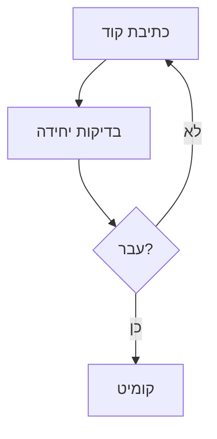
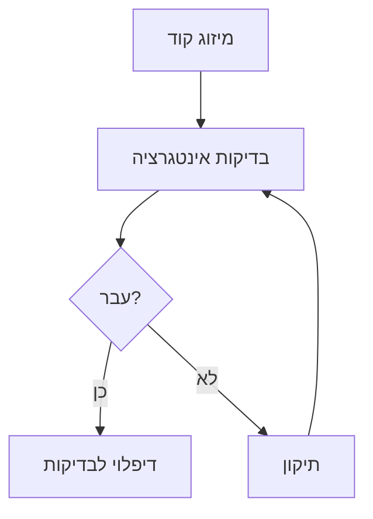
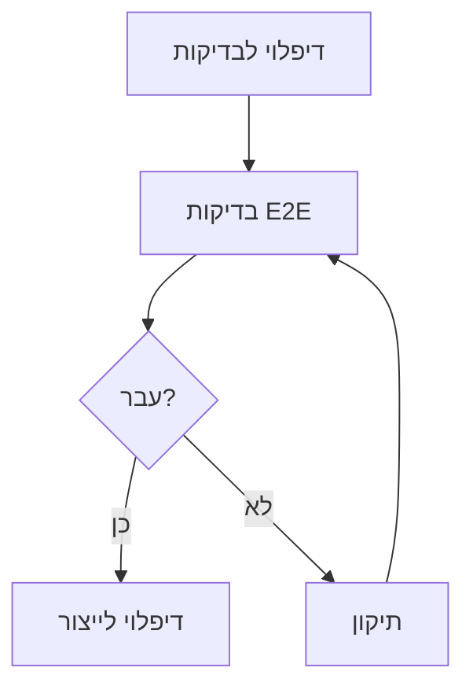

# תוכנית בדיקות - פרויקט "הדרך" 🧪

## 📋 סקירה כללית
מסמך זה מפרט את אסטרטגיית הבדיקות של הפרויקט, כולל סוגי בדיקות, כלים, תהליכים ומדדי הצלחה.

## 🎯 מטרות
1. וידוא איכות ואמינות המערכת
2. זיהוי באגים מוקדם ככל האפשר
3. הבטחת חווית משתמש מיטבית
4. עמידה בדרישות אבטחה ופרטיות
5. וידוא ביצועים ויציבות

## 🔄 תהליך הבדיקות

### שלב 1: בדיקות יחידה


### שלב 2: בדיקות אינטגרציה


### שלב 3: בדיקות E2E


## 📊 סוגי בדיקות

### בדיקות יחידה
- **כלים**: Jest, React Testing Library
- **כיסוי נדרש**: 80%
- **תדירות**: בכל קומיט

#### תבניות בדיקה
\`\`\`typescript
// דוגמה לבדיקת קומפוננטה
describe('AuthComponent', () => {
  it('should render login form', () => {
    render(<AuthComponent />);
    expect(screen.getByRole('form')).toBeInTheDocument();
  });

  it('should handle login submission', async () => {
    render(<AuthComponent />);
    await userEvent.click(screen.getByRole('button'));
    expect(handleSubmit).toHaveBeenCalled();
  });
});
\`\`\`

### בדיקות אינטגרציה
- **כלים**: Cypress
- **כיסוי נדרש**: 70%
- **תדירות**: בכל PR

#### תרחישי בדיקה
1. תהליך הרשמה מלא
2. תהליך התחברות
3. צפייה והתקדמות בקורס
4. אינטראקציה בפורום
5. שימוש במערכת ההמלצות

### בדיקות E2E
- **כלים**: Playwright
- **כיסוי נדרש**: 60%
- **תדירות**: לפני כל דיפלוי לייצור

#### תרחישי בדיקה
1. הרשמה → התחברות → צפייה בקורס → השלמת מבחן
2. התחברות → פרסום בפורום → תגובה → עריכה
3. התחברות → עדכון פרופיל → שינוי הגדרות
4. הרשמה → אימות → שחזור סיסמה

## 🎯 בדיקות לפי תכונות

### אימות והרשאות
- [x] הרשמה והתחברות בסיסית
  ```typescript
  test('user registration flow', async () => {
    // בדיקת הרשמה תקינה
    // בדיקת שגיאות
    // בדיקת ולידציה
  });
  ```

- [ ] אימות דו-שלבי
  ```typescript
  test('2FA flow', async () => {
    // בדיקת שליחת קוד
    // בדיקת אימות
    // בדיקת שגיאות
  });
  ```

### מערכת למידה
- [x] צפייה בקורסים
  ```typescript
  test('course viewing', async () => {
    // בדיקת טעינת וידאו
    // בדיקת מעבר בין שיעורים
    // בדיקת שמירת התקדמות
  });
  ```

- [ ] מעקב התקדמות
  ```typescript
  test('progress tracking', async () => {
    // בדיקת עדכון התקדמות
    // בדיקת חישוב אחוזים
    // בדיקת סנכרון נתונים
  });
  ```

## 📱 בדיקות מכשירים

### נייד
- רזולוציות: 320px, 375px, 414px
- דפדפנים: Chrome, Safari
- מחוות: tap, swipe, pinch
- התראות: push, offline

### טאבלט
- רזולוציות: 768px, 1024px
- דפדפנים: Chrome, Safari, Firefox
- מחוות: stylus, multi-touch
- מצב: portrait, landscape

### דסקטופ
- רזולוציות: 1366px, 1920px
- דפדפנים: Chrome, Firefox, Edge, Safari
- קלט: מקלדת, עכבר
- חלונות: מרובים, מינימום/מקסימום

## 🔍 בדיקות ביצועים

### מדדי Core Web Vitals
- LCP < 2.5s
- FID < 100ms
- CLS < 0.1

### בדיקות עומסים
- **כלים**: k6, Artillery
- **תרחישים**:
  1. 1000 משתמשים בו-זמנית
  2. 100 עדכוני התקדמות/שנייה
  3. 50 הודעות בפורום/שנייה

## 🔒 בדיקות אבטחה

### סריקות אבטחה
- **כלים**: OWASP ZAP, SonarQube
- **תדירות**: שבועית
- **תחומים**:
  1. SQL Injection
  2. XSS
  3. CSRF
  4. Authentication Bypass

### בדיקות תאימות
- GDPR
- WCAG 2.1 AA
- COPPA

## 📈 מדדי הצלחה

### כיסוי בדיקות
- יחידה: 80%
- אינטגרציה: 70%
- E2E: 60%

### יעדי ביצועים
- זמן טעינה: < 3 שניות
- זמן תגובה: < 200ms
- זמינות: 99.9%

### איכות קוד
- Bugs: 0 (Critical/High)
- Technical Debt: < 5%
- Duplications: < 3%

## 🛠️ כלים ותשתיות

### פיתוח
- Jest
- React Testing Library
- Cypress
- Playwright

### CI/CD
- GitHub Actions
- Vercel
- SonarQube

### ניטור
- Sentry
- LogRocket
- Google Analytics

## 📝 הערות
- יש לעדכן את תוכנית הבדיקות בהתאם לשינויים בדרישות
- חשוב לשמור על איזון בין כיסוי לזמן ריצה
- יש לתעד כל באג ופתרון במערכת המעקב
- נדרש לבצע בדיקות רגרסיה לפני כל שחרור